# ALWON POS - Flujo Completo (Versión Mermaid)

## Diagrama Principal

```mermaid
graph TB
    %% FASE 1: REGISTRO PREVIO
    subgraph FASE1["🔵 FASE 1: REGISTRO PREVIO"]
        REGISTRO["<b>Video Portero</b><br/>(Conjunto o Alwon)<br/><br/>Registro de persona:<br/>- Nombre<br/>- Apartamento<br/>- Teléfono<br/>- Correo<br/>- Datos biométricos"]
    end
    
    %% FASE 2: ACCESO (3 TIPOS)
    subgraph FASE2["🔵 FASE 2: ACCESO (3 TIPOS)"]
        LLEGA["<b>Cliente llega</b><br/>a la tienda"]
        
        FACIAL["<b>TIPO 1: FACIAL</b><br/>Reconocimiento facial<br/>Video Portero<br/><br/>✓ Identidad completa<br/>✓ Datos permanentes"]
        PIN["<b>TIPO 2: PIN</b><br/>Ingresa PIN<br/>Video Portero<br/><br/>⚠️ ID temporal<br/>⚠️ Datos se eliminan"]
        NOID["<b>TIPO 3: NO ID</b><br/>Sin permiso o autorizado<br/><br/>❌ Sin identidad<br/>📷 Foto + videos"]
        
        ACCESO["<b>Acceso Autorizado</b>"]
    end
    
    %% FASE 3: COMPRA
    subgraph FASE3["🔵 FASE 3: COMPRA"]
        TIENDA["<b>Cliente en tienda</b><br/>Toma productos"]
        AI["<b>CONCENTRADOR AI</b><br/>(Sistema Externo)<br/><br/>Detecta:<br/>- Productos tomados<br/>- Cliente que toma<br/><br/>Envía a POS:<br/>- Artículos<br/>- Info cliente<br/>- Datos biométricos"]
    end
    
    %% FASE 4: POS RECIBE DATOS
    subgraph FASE4["🔵 FASE 4: POS EN TIEMPO REAL"]
        POSRECIBE["<b>POS (Tablet Android)</b><br/><br/>Recibe en tiempo real:<br/>✓ Clientes activos<br/>✓ Fotos clientes<br/>✓ Artículos por cliente<br/>✓ Datos biométricos"]
        POSMUESTRA["<b>Vista POS Mejorada:</b><br/><br/>🟢 Juan Pérez - Torre 3, Apto 501<br/>   3 items - $25,900<br/><br/>🟡 PIN-7456<br/>   Torre 2, Apto 305<br/>   5 items - $42,300<br/><br/>🔴 No ID - [🥚🥤🍞] +2<br/>   2 items - $8,500"]
        OPRAUTH["<b>Operador Autenticado</b><br/><br/>[💰 Cierre Caja] 👤 Admin"]
    end
    
    %% FASE 5: CHECKOUT
    subgraph FASE5["🔵 FASE 5: CHECKOUT"]
        ACERCA["<b>Cliente se acerca</b><br/>al POS a pagar"]
        SELECCIONA["<b>1. Operador SELECCIONA</b><br/>cliente de la lista"]
        CONFIRMA["<b>2. Operador CONFIRMA</b><br/>identidad del cliente<br/>(compara foto con persona)"]
        CARRITO["<b>3. POS MUESTRA CARRITO</b><br/><br/>Juan Pérez - Torre 3, Apto 501<br/><br/>🥚 Huevos x12: $8,500 (x2)<br/>🥤 Coca-Cola 400ml: $2,500 (x3)<br/>🍞 Pan Tajado: $4,200 (x1)<br/><br/>Total: $28,700<br/><br/>[🔄 Suspender] [❌ Cancelar]<br/><br/>[→ CONTINUAR AL PAGO]"]
    end
    
    %% FASE 6: AJUSTE MANUAL
    subgraph FASE6["🔵 FASE 6: AJUSTE MANUAL"]
        DECISION{"¿Faltan artículos?<br/>(IA en entrenamiento)"}
        AGREGA["<b>SÍ</b><br/><br/>Trabajador AGREGA<br/>artículos faltantes<br/>manualmente"]
    end
    
    %% FASE 7: PAGO
    subgraph FASE7["🔵 FASE 7: PAGO"]
        PROCESA["<b>4. PROCESAR PAGO</b><br/><br/>Método de pago:<br/>□ Tarjeta Débito<br/>□ PSE<br/><br/>[Procesar Pago]"]
        EXITOSO["<b>✓ PAGO EXITOSO</b><br/><br/>- Actualizar inventario<br/>- Generar recibo<br/>- Cerrar sesión cliente"]
    end
    
    %% CONEXIONES PRINCIPALES
    REGISTRO --> LLEGA
    
    %% FASE 2: 3 tipos de acceso
    LLEGA -->|Facial| FACIAL
    LLEGA -->|PIN| PIN
    LLEGA -->|No ID| NOID
    
    FACIAL --> ACCESO
    PIN --> ACCESO
    NOID --> ACCESO
    
    %% FASE 3
    ACCESO --> TIENDA
    TIENDA -.->|Detecta| AI
    
    %% FASE 4
    AI -->|Webhook/API| POSRECIBE
    POSRECIBE --> POSMUESTRA
    POSMUESTRA -..->|Click Operador| OPRAUTH
    
    %% FASE 5
    TIENDA --> ACERCA
    POSMUESTRA --> SELECCIONA
    SELECCIONA --> CONFIRMA
    CONFIRMA --> CARRITO
    
    %% FASE 6
    CARRITO -.-> DECISION
    DECISION -->|SÍ| AGREGA
    AGREGA -.-> CARRITO
    DECISION -->|NO - Todo correcto| PROCESA
    
    %% FASE 7
    PROCESA --> EXITOSO
    
    %% ESTILOS CON COLORES
    style FACIAL fill:#d4edda,stroke:#28a745,stroke-width:2px,color:#000
    style PIN fill:#fff3cd,stroke:#ffc107,stroke-width:2px,color:#000
    style NOID fill:#f8d7da,stroke:#dc3545,stroke-width:2px,color:#000
    
    style REGISTRO fill:#dae8fc,stroke:#6c8ebf,stroke-width:2px,color:#000
    style LLEGA fill:#fff2cc,stroke:#d6b656,stroke-width:2px,color:#000
    style ACCESO fill:#cfe2ff,stroke:#0d6efd,stroke-width:2px,color:#000
    
    style TIENDA fill:#fff2cc,stroke:#d6b656,stroke-width:2px,color:#000
    style AI fill:#e1d5e7,stroke:#9673a6,stroke-width:2px,color:#000
    
    style POSRECIBE fill:#f8cecc,stroke:#b85450,stroke-width:2px,color:#000
    style POSMUESTRA fill:#fff2cc,stroke:#d6b656,stroke-width:2px,color:#000
    style OPRAUTH fill:#d4edda,stroke:#28a745,stroke-width:2px,color:#000
    
    style SELECCIONA fill:#ffe6cc,stroke:#d79b00,stroke-width:2px,color:#000
    style CONFIRMA fill:#ffe6cc,stroke:#d79b00,stroke-width:2px,color:#000
    style CARRITO fill:#d4edda,stroke:#28a745,stroke-width:2px,color:#000
    
    style DECISION fill:#fff2cc,stroke:#d6b656,stroke-width:2px,color:#000
    style AGREGA fill:#f8d7da,stroke:#dc3545,stroke-width:2px,color:#000
    
    style PROCESA fill:#cfe2ff,stroke:#0d6efd,stroke-width:2px,color:#000
    style EXITOSO fill:#d4edda,stroke:#28a745,stroke-width:2px,color:#000
```

---

## Leyenda de Colores

| Color | Significado |
|-------|-------------|
| 🟢 **Verde** `#d4edda` | TIPO 1: FACIAL - Cliente registrado, identidad completa |
| 🟡 **Amarillo** `#fff3cd` | TIPO 2: PIN - Cliente temporal, datos se eliminan |
| 🔴 **Rojo** `#f8d7da` | TIPO 3: NO IDENTIFICADO - Sin identidad, con evidencia |
| 🔵 **Azul claro** `#cfe2ff` | Elementos del sistema POS |
| 🟦 **Azul** `#dae8fc` | Sistema Video Portero |
| 🟣 **Morado** `#e1d5e7` | Concentrador AI (Sistema Externo) |
| 🟠 **Naranja** `#ffe6cc` | Acciones del Operador |
| 🟡 **Amarillo suave** `#fff2cc` | Cliente/Persona |

---

## Detalles de los 3 Tipos de Acceso

### 🟢 TIPO 1: FACIAL
- **Método:** Reconocimiento facial en Video Portero
- **Cliente:** Registrado previamente
- **Identificación:** Completa (nombre, apartamento, foto)
- **Datos:** Permanentes
- **POS recibe:** ID cliente, nombre completo, foto, carrito en tiempo real

### 🟡 TIPO 2: PIN
- **Método:** Ingresa PIN en Video Portero
- **Cliente:** Temporal (no dio permiso facial)
- **Identificación:** Por cámaras internas
- **Datos:** Se eliminan tras el pago
- **POS recibe:** ID temporal (PIN-XXX), foto biométrica temporal, carrito
- **Post-pago:** ❌ Borrar foto biométrica y ID temporal

### 🔴 TIPO 3: NO IDENTIFICADO
- **Método:** Ingresa sin permiso o autorizado por persona registrada
- **Cliente:** Sin identidad conocida
- **Identificación:** Ninguna
- **Datos:** Foto física + video/GIF por cada producto
- **POS recibe:** ID único (NOID-XXX), foto de la persona, carrito con evidencia visual
- **Operador debe:** Verificar evidencia visual de cada producto

---

## Notas Importantes

1. **Los 3 tipos convergen** en "Acceso Autorizado" y luego siguen el mismo flujo
2. **Fase 6 (Ajuste Manual)** permite al trabajador corregir errores de la IA
3. **Fase 7 (Pago)** admite PSE y Tarjeta Débito
4. **Concentrador AI** es un sistema externo que envía datos al POS vía Webhook/API
5. **Datos temporales (PIN)** se eliminan inmediatamente después del pago exitoso
