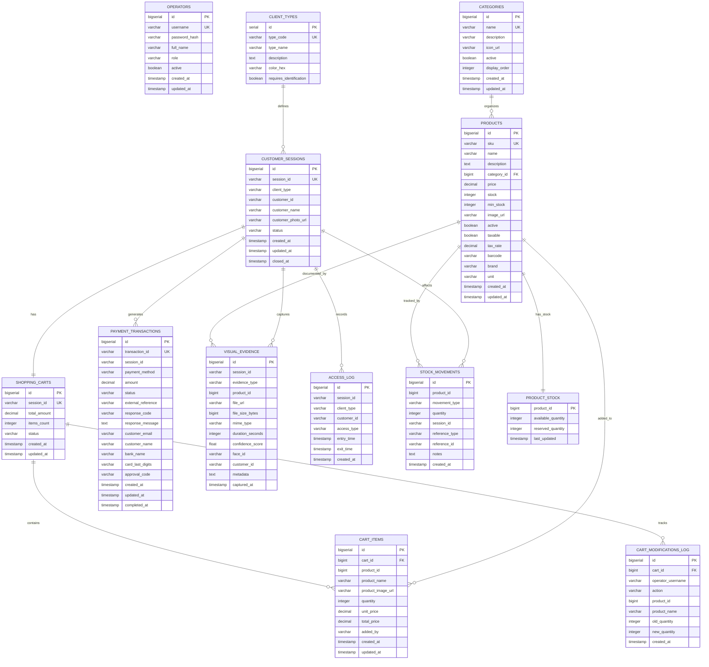

# Alwon POS - Diagrama del Modelo de Base de Datos

## Diagrama Entidad-Relación Completo

```mermaid
erDiagram
    %% =====================================
    %% SESSIONS SCHEMA
    %% =====================================
    
    OPERATORS {
        bigserial id PK
        varchar username UK
        varchar password_hash
        varchar full_name
        varchar role
        boolean active
        timestamp created_at
        timestamp updated_at
    }
    
    CUSTOMER_SESSIONS {
        bigserial id PK
        varchar session_id UK
        varchar client_type
        varchar customer_id
        varchar customer_name
        varchar customer_photo_url
        varchar status
        timestamp created_at
        timestamp updated_at
        timestamp closed_at
    }
    
    %% =====================================
    %% CARTS SCHEMA
    %% =====================================
    
    SHOPPING_CARTS {
        bigserial id PK
        varchar session_id UK
        decimal total_amount
        integer items_count
        varchar status
        timestamp created_at
        timestamp updated_at
    }
    
    CART_ITEMS {
        bigserial id PK
        bigint cart_id FK
        bigint product_id
        varchar product_name
        varchar product_image_url
        integer quantity
        decimal unit_price
        decimal total_price
        varchar added_by
        timestamp created_at
        timestamp updated_at
    }
    
    CART_MODIFICATIONS_LOG {
        bigserial id PK
        bigint cart_id FK
        varchar operator_username
        varchar action
        bigint product_id
        varchar product_name
        integer old_quantity
        integer new_quantity
        timestamp created_at
    }
    
    %% =====================================
    %% PRODUCTS SCHEMA
    %% =====================================
    
    CATEGORIES {
        bigserial id PK
        varchar name UK
        varchar description
        varchar icon_url
        boolean active
        integer display_order
        timestamp created_at
        timestamp updated_at
    }
    
    PRODUCTS {
        bigserial id PK
        varchar sku UK
        varchar name
        text description
        bigint category_id FK
        decimal price
        integer stock
        integer min_stock
        varchar image_url
        boolean active
        boolean taxable
        decimal tax_rate
        varchar barcode
        varchar brand
        varchar unit
        timestamp created_at
        timestamp updated_at
    }
    
    %% =====================================
    %% PAYMENTS SCHEMA
    %% =====================================
    
    PAYMENT_TRANSACTIONS {
        bigserial id PK
        varchar transaction_id UK
        varchar session_id
        varchar payment_method
        decimal amount
        varchar status
        varchar external_reference
        varchar response_code
        text response_message
        varchar customer_email
        varchar customer_name
        varchar bank_name
        varchar card_last_digits
        varchar approval_code
        timestamp created_at
        timestamp updated_at
        timestamp completed_at
    }
    
    %% =====================================
    %% CAMERA SCHEMA
    %% =====================================
    
    VISUAL_EVIDENCE {
        bigserial id PK
        varchar session_id
        varchar evidence_type
        bigint product_id
        varchar file_url
        bigint file_size_bytes
        varchar mime_type
        integer duration_seconds
        float confidence_score
        varchar face_id
        varchar customer_id
        text metadata
        timestamp captured_at
    }
    
    %% =====================================
    %% ACCESS SCHEMA
    %% =====================================
    
    CLIENT_TYPES {
        serial id PK
        varchar type_code UK
        varchar type_name
        text description
        varchar color_hex
        boolean requires_identification
    }
    
    ACCESS_LOG {
        bigserial id PK
        varchar session_id
        varchar client_type
        varchar customer_id
        varchar access_type
        timestamp entry_time
        timestamp exit_time
        timestamp created_at
    }
    
    %% =====================================
    %% INVENTORY SCHEMA
    %% =====================================
    
    STOCK_MOVEMENTS {
        bigserial id PK
        bigint product_id
        varchar movement_type
        integer quantity
        varchar session_id
        varchar reference_type
        varchar reference_id
        text notes
        timestamp created_at
    }
    
    PRODUCT_STOCK {
        bigint product_id PK
        integer available_quantity
        integer reserved_quantity
        timestamp last_updated
    }
    
    %% =====================================
    %% RELATIONSHIPS
    %% =====================================
    
    %% Carts relationships
    SHOPPING_CARTS ||--o{ CART_ITEMS : "contains"
    SHOPPING_CARTS ||--o{ CART_MODIFICATIONS_LOG : "tracks"
    CUSTOMER_SESSIONS ||--|| SHOPPING_CARTS : "has"
    
    %% Products relationships
    CATEGORIES ||--o{ PRODUCTS : "organizes"
    PRODUCTS ||--o{ CART_ITEMS : "added_to"
    PRODUCTS ||--|| PRODUCT_STOCK : "has_stock"
    PRODUCTS ||--o{ STOCK_MOVEMENTS : "tracked_by"
    PRODUCTS ||--o{ VISUAL_EVIDENCE : "documented_by"
    
    %% Sessions relationships
    CUSTOMER_SESSIONS ||--o{ PAYMENT_TRANSACTIONS : "generates"
    CUSTOMER_SESSIONS ||--o{ VISUAL_EVIDENCE : "captures"
    CUSTOMER_SESSIONS ||--o{ ACCESS_LOG : "records"
    CUSTOMER_SESSIONS ||--o{ STOCK_MOVEMENTS : "affects"
    
    %% Access relationship
    CLIENT_TYPES ||--o{ CUSTOMER_SESSIONS : "defines"
```

## Esquemas por Microservicio

### 1️⃣ Sessions Schema (Session Service - Port 8081)
- **OPERATORS**: Credenciales de operadores del sistema
- **CUSTOMER_SESSIONS**: Sesiones activas de clientes

**Relaciones:**
- Una sesión tiene un carrito
- Una sesión genera transacciones de pago
- Una sesión captura evidencia visual
- Una sesión registra accesos

---

### 2️⃣ Carts Schema (Cart Service - Port 8082)
- **SHOPPING_CARTS**: Carritos de compra por sesión
- **CART_ITEMS**: Ítems individuales en carritos
- **CART_MODIFICATIONS_LOG**: Auditoría de cambios por staff

**Relaciones:**
- Un carrito pertenece a una sesión (1:1)
- Un carrito tiene múltiples ítems (1:N)
- Un carrito registra m√∫ltiples modificaciones (1:N)
- Los ítems referencian productos

---

### 3️⃣ Products Schema (Product Service - Port 8083)
- **CATEGORIES**: Categorías de productos
- **PRODUCTS**: Cat√°logo completo de productos

**Relaciones:**
- Una categoría agrupa múltiples productos (1:N)
- Un producto puede estar en m√∫ltiples carritos
- Un producto tiene stock en inventario
- Un producto puede tener evidencia visual

---

### 4️⃣ Payments Schema (Payment Service - Port 8084)
- **PAYMENT_TRANSACTIONS**: Transacciones de pago

**Métodos Soportados:**
- PSE (Pagos Seguros en Línea)
- DEBIT (Tarjeta Débito)
- CREDIT (Tarjeta Crédito)

**Estados:**
- PENDING ‚Üí PROCESSING ‚Üí APPROVED/REJECTED/FAILED/CANCELLED

**Relaciones:**
- Una sesión puede tener múltiples transacciones (1:N)

---

### 5️⃣ Camera Schema (Camera Service - Port 8085)
- **VISUAL_EVIDENCE**: Evidencia visual capturada

**Tipos de Evidencia:**
- FACIAL_PHOTO: Reconocimiento facial
- PRODUCT_VIDEO: Videos de productos
- PRODUCT_GIF: GIFs de productos
- ENTRY_PHOTO: Foto al entrar
- EXIT_PHOTO: Foto al salir

**Relaciones:**
- Una sesión captura múltiples evidencias (1:N)
- Una evidencia puede estar asociada a un producto

---

### 6️⃣ Access Schema (Access Service - Port 8086)
- **CLIENT_TYPES**: Tipos de cliente configurados
- **ACCESS_LOG**: Registro de entradas/salidas

**Tipos de Cliente:**
- 🟢 **FACIAL**: Cliente con ID permanente (reconocimiento facial)
- üü° **PIN**: Cliente temporal (PIN eliminado tras pago)
- 🔴 **NO_ID**: Sin identificación (requiere evidencia visual)

**Relaciones:**
- Un tipo de cliente define m√∫ltiples sesiones (1:N)
- Una sesión registra múltiples accesos (1:N)

---

### 7️⃣ Inventory Schema (Inventory Service - Port 8087)
- **STOCK_MOVEMENTS**: Movimientos de inventario
- **PRODUCT_STOCK**: Stock actual por producto

**Tipos de Movimiento:**
- SALE: Venta
- RETURN: Devolución
- ADJUSTMENT: Ajuste manual
- RESTOCK: Reabastecimiento
- DAMAGE: Producto dañado

**Relaciones:**
- Un producto tiene un registro de stock (1:1)
- Un producto registra m√∫ltiples movimientos (1:N)
- Una sesión puede afectar múltiples movimientos (1:N)

---

## Estadísticas del Modelo

| Métrica | Valor |
|---------|-------|
| **Total Esquemas** | 7 |
| **Total Tablas** | 13 |
| **Total Índices** | 27 |
| **Relaciones 1:1** | 2 |
| **Relaciones 1:N** | 13 |
| **Foreign Keys** | 5 |

## Notas Técnicas

### Claves Primarias
- Todas usan `BIGSERIAL` (auto-increment) excepto `CLIENT_TYPES` (SERIAL)
- Identificadores de negocio (`session_id`, `transaction_id`, `sku`) tienen índices únicos

### Timestamps
- Todas las tablas incluyen `created_at`
- Tablas modificables incluyen `updated_at`
- Tablas con workflows incluyen timestamps de estado (`closed_at`, `completed_at`)

### Índices de Performance
- **27 índices** optimizan consultas frecuentes
- Foreign keys indexados
- Campos de b√∫squeda indexados (SKU, barcode, session_id, etc.)
- Campos de filtro indexados (status, active, client_type)

### Datos de Muestra
- ‚úÖ 1 Operador admin (password: admin)
- ✅ 5 Categorías de productos
- ‚úÖ 10 Productos de muestra
- ‚úÖ 3 Tipos de cliente pre-configurados
- ‚úÖ Stock inicial para productos (100 unidades c/u)
