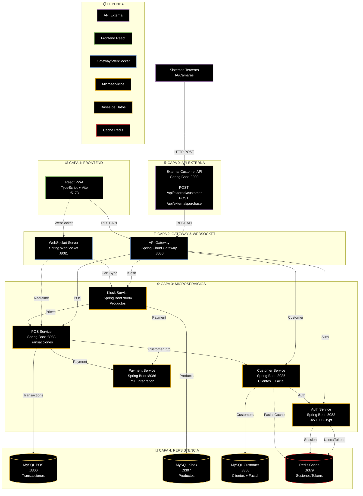

# Arquitectura de Microservicios - Alwon POS
## Versión con API Externa para Sistemas Terceros

Este diagrama muestra la arquitectura completa del sistema Alwon POS, incluyendo la nueva capa de API Externa que permite recibir información de clientes y compras desde sistemas de terceros (IA/Cámaras).

## Descripción de Capas

### 🌐 Capa 0: API Externa
**Propósito**: Recibir información de sistemas de terceros (IA, cámaras, otros sistemas) sobre clientes y compras.

- **External Customer API** (Puerto 9000)
  - `POST /api/external/customer` - Recibe información de clientes identificados
  - `POST /api/external/purchase` - Recibe información de compras detectadas
  - Manejo temporal de archivos multimedia
  - Integración con el API Gateway para enrutamiento interno

### 💻 Capa 1: Frontend
**Propósito**: Interfaz de usuario para operadores del POS.

- **React PWA** (Puerto 5173)
  - TypeScript + Vite
  - Zustand para estado global
  - Soporte offline (PWA)
  - Diseño responsivo para tablets Android

### 🚪 Capa 2: Gateway & WebSocket
**Propósito**: Punto de entrada unificado y comunicación en tiempo real.

- **API Gateway** (Puerto 8080)
  - Enrutamiento centralizado
  - Balanceo de carga
  - Autenticación/Autorización
  
- **WebSocket Server** (Puerto 8081)
  - Actualizaciones en tiempo real
  - Sincronización de carritos
  - Notificaciones push

### ⚙️ Capa 3: Microservicios
**Propósito**: Lógica de negocio separada por dominio.

- **Auth Service** (Puerto 8082) - Autenticación JWT + BCrypt
- **POS Service** (Puerto 8083) - Gestión de transacciones
- **Kiosk Service** (Puerto 8084) - Catálogo de productos
- **Customer Service** (Puerto 8085) - Clientes + Reconocimiento facial
- **Payment Service** (Puerto 8086) - Integración con PSE

### 💾 Capa 4: Persistencia
**Propósito**: Almacenamiento de datos persistente y caché.

- **MySQL Databases** (Puertos 3306-3308) - Una base de datos por dominio
- **Redis Cache** (Puerto 6379) - Sesiones, tokens y caché de reconocimiento facial

## Características Clave

### 🔒 Seguridad
- JWT para autenticación
- BCrypt para passwords
- Tokens en Redis con TTL
- Validación en API Gateway

### 🔄 Escalabilidad
- Arquitectura de microservicios
- Base de datos por servicio
- Cache distribuido
- WebSocket para real-time

### 📱 Conectividad
- **API Externa**: Sistemas terceros → Alwon
- **REST API**: Frontend → Backend
- **WebSocket**: Comunicación bidireccional en tiempo real
- **Inter-service**: Comunicación entre microservicios

### 🎯 Flujo de Datos Principal

1. **Sistema Externo** detecta cliente y productos
2. **External API** recibe datos vía POST
3. **API Gateway** enruta a servicios correspondientes
4. **Customer Service** procesa reconocimiento facial
5. **Kiosk Service** gestiona productos del carrito
6. **WebSocket** sincroniza con el frontend en tiempo real
7. **POS Service** procesa la transacción
8. **Payment Service** ejecuta el pago PSE

## Leyenda de Colores

- 🟣 **Violeta** - API Externa (Sistemas Terceros)
- 🟢 **Verde** - Frontend (React PWA)
- 🔵 **Azul** - Gateway & WebSocket
- 🟡 **Amarillo** - Microservicios
- 🟨 **Amarillo Claro** - Bases de Datos
- 🔴 **Rojo** - Cache (Redis)

## Tipos de Conexiones

- **Línea Sólida** (→) - Comunicación REST/HTTP
- **Línea Punteada** (-..->) - Comunicación WebSocket o Cache

---

**Versión**: 2.0 - Con API Externa  
**Fecha**: Diciembre 2025  
**Proyecto**: Alwon POS
