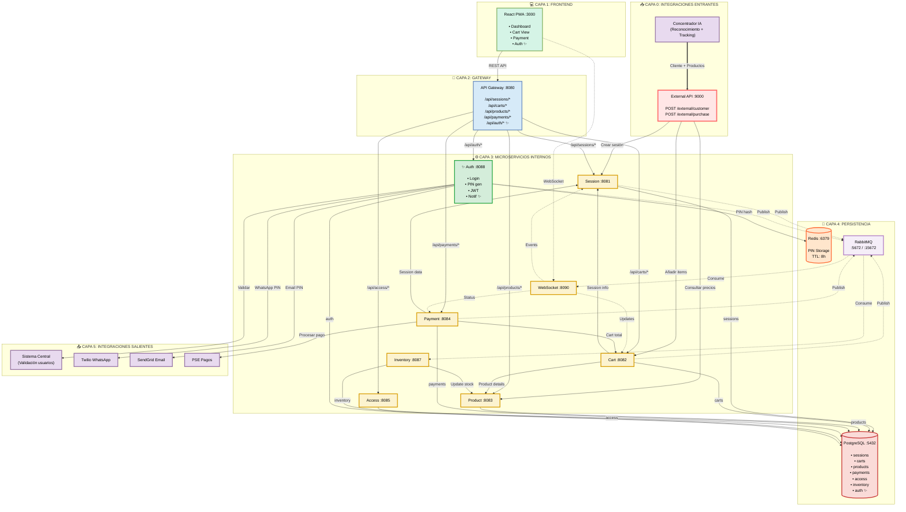

# Arquitectura de Microservicios - Alwon POS

## Versión Actualizada (25 Diciembre 2025)

Sistema Alwon POS con separación clara de integraciones entrantes y salientes.

---

## 📊 Estructura de Capas

### 📥 Capa 0: Integraciones Entrantes
**Sistemas que NOS LLAMAN**
- Concentrador IA → External API :9000

### 💻 Capa 1-4: Sistema Core
- **Capa 1:** Frontend React PWA
- **Capa 2:** API Gateway  
- **Capa 3:** Microservicios (Session, Cart, Product, Payment, Auth, etc.)
- **Capa 4:** Persistencia (PostgreSQL, Redis, RabbitMQ)

### 📤 Capa 5: Integraciones Salientes
**Sistemas que NOSOTROS LLAMAMOS**
- Sistema Central - Validación de operadores
- Twilio - WhatsApp (PIN)
- SendGrid - Email (PIN)
- PSE - Pagos

---

## ✨ Auth Service (Puerto 8088)

**Responsabilidades:**
- Login con usuario/contraseña
- Generación de PIN temporal (6 dígitos)
- Envío directo a Twilio (WhatsApp)
- Envío directo a SendGrid (Email)
- Almacenamiento en Redis (hash BCrypt, TTL 8h)
- JWT tokens
- Audit log

**Endpoints:**
- `POST /auth/login`
- `POST /auth/validate-pin`
- `POST /auth/logout`
- `GET /auth/session`

---

## � Decisiones de Arquitectura

### ❌ Eliminado:
- **Notification Service** (Puerto 8089) → Simplicidad

### ✅ Auth Service ahora:
- Llama **directamente** a Twilio WhatsApp API
- Llama **directamente** a SendGrid Email API
- Reduce latencia y complejidad

### 🏗️ Separación de Capas:
- **Capa 0:** Solo ENTRANTES (quién nos llama)
- **Capa 5:** Solo SALIENTES (a quién llamamos)
- Claridad en flujo de datos

---

**Actualizado:** 25 Diciembre 2025  
**Motor:** Mermaid v9+
