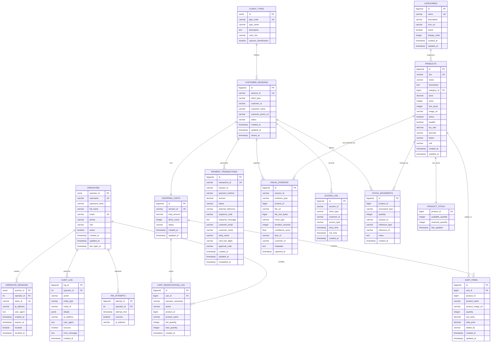

# Alwon POS - Diagrama del Modelo de Base de Datos

## Versión Actualizada (25 Diciembre 2025)

Este diagrama muestra el modelo de base de datos completo del sistema Alwon POS, incluyendo el nuevo schema de autenticación de operadores.

## Diagrama Entidad-Relación Completo

---

## Esquemas por Microservicio

### 🔐 Auth Schema ✨ NUEVO (Auth Service - Port 8088)

**Tablas:**

#### 1. `auth.operators`
**Propósito:** Almacenar información de operadores del POS

| Columna | Tipo | Descripción |
|---------|------|-------------|
| `operator_id` | SERIAL PK | ID único del operador |
| `username` | VARCHAR(50) UK | Nombre de usuario único |
| `password_hash` | VARCHAR(255) | Hash BCrypt del password (costo 10) |
| `full_name` | VARCHAR(100) | Nombre completo |
| `email` | VARCHAR(100) UK | Email único |
| `phone` | VARCHAR(20) | Teléfono para notificaciones |
| `role` | VARCHAR(20) | OPERATOR, SUPERVISOR, ADMIN |
| `active` | BOOLEAN | Estado activo/inactivo |
| `created_at` | TIMESTAMP | Fecha de creación |
| `updated_at` | TIMESTAMP | Última actualización |
| `last_login_at` | TIMESTAMP NULL | Último login |

**Índices:**
- `idx_operators_username` en `username`
- `idx_operators_email` en `email`
- `idx_operators_active` en `active`

---

#### 2. `auth.operator_sessions`
**Propósito:** Track de sesiones activas (JWT tokens)

| Columna | Tipo | Descripción |
|---------|------|-------------|
| `session_id` | SERIAL PK | ID de sesión |
| `operator_id` | INT FK | Referencia al operador |
| `token_jti` | VARCHAR(255) UK | JWT Token ID para blacklist |
| `ip_address` | VARCHAR(45) | IP del login |
| `user_agent` | TEXT | Navegador/dispositivo |
| `created_at` | TIMESTAMP | Creación de token |
| `expires_at` | TIMESTAMP | Expiración del token |
| `revoked` | BOOLEAN | Token revocado |
| `revoked_at` | TIMESTAMP NULL | Fecha de revocación |

**Índices:**
- `idx_sessions_operator` en `operator_id`
- `idx_sessions_token` en `token_jti`
- `idx_sessions_active` en `(revoked, expires_at)`

---

#### 3. `auth.audit_log`
**Propósito:** Log de auditoría de acciones administrativas

| Columna | Tipo | Descripción |
|---------|------|-------------|
| `log_id` | BIGSERIAL PK | ID del log |
| `operator_id` | INT FK NULL | Operador que realizó la acción |
| `action` | VARCHAR(50) | Tipo de acción (LOGIN, LOGOUT, CLOSE_DAY, etc) |
| `entity_type` | VARCHAR(50) | Tipo de entidad afectada |
| `entity_id` | VARCHAR(100) | ID de la entidad |
| `details` | JSONB | Detalles adicionales en JSON |
| `ip_address` | VARCHAR(45) | IP del request |
| `user_agent` | TEXT | Navegador/dispositivo |
| `success` | BOOLEAN | Acción exitosa |
| `error_message` | TEXT NULL | Mensaje de error si falla |
| `created_at` | TIMESTAMP | Timestamp del evento |

**Índices:**
- `idx_audit_operator` en `operator_id`
- `idx_audit_action` en `action`
- `idx_audit_created` en `created_at DESC`

---

#### 4. `auth.pin_attempts`
**Propósito:** Registro de intentos de PIN (backup de Redis)

| Columna | Tipo | Descripción |
|---------|------|-------------|
| `attempt_id` | BIGSERIAL PK | ID del intento |
| `operator_id` | INT FK | Operador |
| `attempt_time` | TIMESTAMP | Timestamp del intento |
| `success` | BOOLEAN | Intento exitoso |
| `ip_address` | VARCHAR(45) | IP del intento |

**Índices:**
- `idx_pin_attempts_operator` en `operator_id`
- `idx_pin_attempts_time` en `attempt_time DESC`

---

### 1️⃣ Sessions Schema (Session Service - Port 8081)

#### `sessions.customer_sessions`
**Propósito:** Gestión de sesiones de clientes en la tienda

| Columna | Tipo | Descripción |
|---------|------|-------------|
| `id` | BIGSERIAL PK | ID autoincrementable |
| `session_id` | VARCHAR UK | ID único de sesión |
| `client_type` | VARCHAR | FACIAL, PIN, NO_ID |
| `customer_id` | VARCHAR | ID del cliente (opcional para NO_ID) |
| `customer_name` | VARCHAR | Nombre del cliente |
| `customer_photo_url` | VARCHAR | URL de la foto |
| `status` | VARCHAR | ACTIVE, SUSPENDED, AT_CHECKOUT, CLOSED |
| `created_at` | TIMESTAMP | Creación de sesión |
| `updated_at` | TIMESTAMP | Última actualización |
| `closed_at` | TIMESTAMP | Cierre de sesión |

---

### 2️⃣ Carts Schema (Cart Service - Port 8082)

#### `carts.carts`
**Propósito:** Carritos de compra asociados a sesiones

| Columna | Tipo | Descripción |
|---------|------|-------------|
| `id` | BIGSERIAL PK | ID del carrito |
| `session_id` | VARCHAR UK | Referencia a sesión |
| `total_amount` | DECIMAL(10,2) | Total del carrito |
| `items_count` | INT | Número de items |
| `status` | VARCHAR | ACTIVE, CHECKOUT, COMPLETED |
| `created_at` | TIMESTAMP | Creación |
| `updated_at` | TIMESTAMP | Última actualización |

#### `carts.cart_items`
**Propósito:** Items individuales del carrito

| Columna | Tipo | Descripción |
|---------|------|-------------|
| `id` | BIGSERIAL PK | ID del item |
| `cart_id` | BIGINT FK | Referencia al carrito |
| `product_id` | BIGINT | ID del producto |
| `product_name` | VARCHAR | Nombre del producto |
| `product_image_url` | VARCHAR | Imagen del producto |
| `quantity` | INT | Cantidad |
| `unit_price` | DECIMAL(10,2) | Precio unitario |
| `total_price` | DECIMAL(10,2) | Precio total |
| `added_by` | VARCHAR | AI o MANUAL |
| `created_at` | TIMESTAMP | Fecha de adición |
| `updated_at` | TIMESTAMP | Última actualización |

#### `carts.cart_modifications_log`
**Propósito:** Auditoría de modificaciones manuales al carrito

| Columna | Tipo | Descripción |
|---------|------|-------------|
| `id` | BIGSERIAL PK | ID del log |
| `cart_id` | BIGINT FK | Carrito modificado |
| `operator_username` | VARCHAR | Operador que modificó ✨ |
| `action` | VARCHAR | ADD, REMOVE, UPDATE_QUANTITY |
| `product_id` | BIGINT | Producto afectado |
| `product_name` | VARCHAR | Nombre del producto |
| `old_quantity` | INT | Cantidad anterior |
| `new_quantity` | INT | Nueva cantidad |
| `created_at` | TIMESTAMP | Timestamp |

---

### 3️⃣ Products Schema (Product Service - Port 8083)

#### `products.categories`
**Propósito:** Categorías de productos

| Columna | Tipo | Descripción |
|---------|------|-------------|
| `id` | BIGSERIAL PK | ID de categoría |
| `name` | VARCHAR UK | Nombre único |
| `description` | VARCHAR | Descripción |
| `icon_url` | VARCHAR | Icono de categoría |
| `active` | BOOLEAN | Activa/Inactiva |
| `display_order` | INT | Orden de visualización |
| `created_at` | TIMESTAMP | Creación |
| `updated_at` | TIMESTAMP | Actualización |

#### `products.products`
**Propósito:** Catálogo completo de productos

| Columna | Tipo | Descripción |
|---------|------|-------------|
| `id` | BIGSERIAL PK | ID del producto |
| `sku` | VARCHAR UK | Código único |
| `name` | VARCHAR | Nombre del producto |
| `description` | TEXT | Descripción |
| `category_id` | BIGINT FK | Categoría |
| `price` | DECIMAL(10,2) | Precio |
| `stock` | INT | Stock actual |
| `min_stock` | INT | Stock mínimo |
| `image_url` | VARCHAR | Imagen |
| `active` | BOOLEAN | Activo/Inactivo |
| `taxable` | BOOLEAN | Aplica impuestos |
| `tax_rate` | DECIMAL(5,2) | Tasa de impuesto |
| `barcode` | VARCHAR | Código de barras |
| `brand` | VARCHAR | Marca |
| `unit` | VARCHAR | Unidad (unidad, kg, litro) |
| `created_at` | TIMESTAMP | Creación |
| `updated_at` | TIMESTAMP | Actualización |

---

### 4️⃣ Payments Schema (Payment Service - Port 8084)

#### `payments.payment_transactions`
**Propósito:** Transacciones de pago (PSE, tarjeta)

| Columna | Tipo | Descripción |
|---------|------|-------------|
| `id` | BIGSERIAL PK | ID de transacción |
| `transaction_id` | VARCHAR UK | ID único de PSE |
| `session_id` | VARCHAR | Sesión asociada |
| `payment_method` | VARCHAR | PSE, DEBIT_CARD |
| `amount` | DECIMAL(10,2) | Monto |
| `status` | VARCHAR | PENDING, APPROVED, DECLINED |
| `external_reference` | VARCHAR | Referencia PSE |
| `response_code` | VARCHAR | Código de respuesta |
| `response_message` | TEXT | Mensaje de respuesta |
| `customer_email` | VARCHAR | Email para recibo |
| `customer_name` | VARCHAR | Nombre del cliente |
| `bank_name` | VARCHAR | Banco (PSE) |
| `card_last_digits` | VARCHAR | Últimos 4 dígitos |
| `approval_code` | VARCHAR | Código de aprobación |
| `created_at` | TIMESTAMP | Inicio de transacción |
| `updated_at` | TIMESTAMP | Última actualización |
| `completed_at` | TIMESTAMP | Completado/Rechazado |

---

### 5️⃣ Camera Schema (Camera Service - Port 8085)

#### `camera.visual_evidence`
**Propósito:** Evidencia visual (fotos/videos de productos y clientes)

| Columna | Tipo | Descripción |
|---------|------|-------------|
| `id` | BIGSERIAL PK | ID de evidencia |
| `session_id` | VARCHAR | Sesión asociada |
| `evidence_type` | VARCHAR | PHOTO, VIDEO, GIF |
| `product_id` | BIGINT | Producto detectado |
| `file_url` | VARCHAR | URL del archivo |
| `file_size_bytes` | BIGINT | Tamaño del archivo |
| `mime_type` | VARCHAR | Tipo MIME |
| `duration_seconds` | INT | Duración (videos) |
| `confidence_score` | FLOAT | Confianza IA (0-1) |
| `face_id` | VARCHAR | ID facial del cliente |
| `customer_id` | VARCHAR | ID del cliente |
| `metadata` | TEXT | Metadatos JSON |
| `captured_at` | TIMESTAMP | Momento de captura |

---

### 6️⃣ Access Schema (Access Service - Port 8086)

#### `access.client_types`
**Propósito:** Definición de tipos de cliente

| Columna | Tipo | Descripción |
|---------|------|-------------|
| `id` | SERIAL PK | ID tipo |
| `type_code` | VARCHAR UK | FACIAL, PIN, NO_ID |
| `type_name` | VARCHAR | Nombre descriptivo |
| `description` | TEXT | Descripción |
| `color_hex` | VARCHAR | Color UI |
| `requires_identification` | BOOLEAN | Requiere ID |

#### `access.access_log`
**Propósito:** Log de entradas/salidas

| Columna | Tipo | Descripción |
|---------|------|-------------|
| `id` | BIGSERIAL PK | ID log |
| `session_id` | VARCHAR | Sesión |
| `client_type` | VARCHAR | Tipo de cliente |
| `customer_id` | VARCHAR | ID cliente |
| `access_type` | VARCHAR | ENTRY, EXIT |
| `entry_time` | TIMESTAMP | Hora entrada |
| `exit_time` | TIMESTAMP | Hora salida |
| `created_at` | TIMESTAMP | Creación |

---

### 7️⃣ Inventory Schema (Inventory Service - Port 8087)

#### `inventory.stock_movements`
**Propósito:** Movimientos de inventario

| Columna | Tipo | Descripción |
|---------|------|-------------|
| `id` | BIGSERIAL PK | ID movimiento |
| `product_id` | BIGINT | Producto |
| `movement_type` | VARCHAR | SALE, RESTOCK, ADJUSTMENT, DAMAGE |
| `quantity` | INT | Cantidad (+ o -) |
| `session_id` | VARCHAR | Sesión asociada |
| `reference_type` | VARCHAR | Tipo de referencia |
| `reference_id` | VARCHAR | ID de referencia |
| `notes` | TEXT | Notas |
| `created_at` | TIMESTAMP | Timestamp |

#### `inventory.product_stock`
**Propósito:** Stock actual por producto

| Columna | Tipo | Descripción |
|---------|------|-------------|
| `product_id` | BIGINT PK | Producto |
| `available_quantity` | INT | Cantidad disponible |
| `reserved_quantity` | INT | Cantidad reservada |
| `last_updated` | TIMESTAMP | Última actualización |

---

## Estadísticas del Modelo

| Métrica | Valor |
|---------|-------|
| **Total Schemas** | 8 (sessions, carts, products, payments, camera, access, inventory, **auth** ✨) |
| **Total Tablas** | 19 (15 originales + 4 nuevas de auth) |
| **Total Relaciones** | 17 (13 originales + 4 nuevas de auth) |
| **Microservicios** | 9 (8 originales + 1 nuevo: Auth Service) |

---

## Notas Técnicas

### Claves Primarias
- Todas las tablas usan `SERIAL` o `BIGSERIAL` para IDs autoincrementables
- Las tablas de log usan `BIGSERIAL` por el alto volumen esperado

### Timestamps
- `created_at`: Fecha de creación del registro
- `updated_at`: Última modificación (auto-actualizado vía trigger)
- Campos específicos de negocio: `closed_at`, `completed_at`, `expired_at`, `last_login_at` ✨

### Índices de Performance
- Índices en foreign keys para JOINs rápidos
- Índices en campos de búsqueda frecuente (`session_id`, `sku`, `username` ✨)
- Índices compuestos en campos de filtrado común

### Seguridad ✨ NUEVO
- **Passwords**: Hash BCrypt con costo 10 (nunca almacenar passwords en texto plano)
- **JWT Tokens**: `token_jti` permite blacklist para logout
- **Audit Log**: Registro completo de acciones administrativas con JSONB para flexibilidad
- **PIN Storage**: PINs se almacenan en Redis (no en PostgreSQL) con hash BCrypt y TTL de 8 horas

### Datos de Muestra
- Script `init-auth-schema.sql` incluye 3 operadores de prueba ✨
- Todos los passwords de prueba: `alwon2025`
- Usuarios: `carlos.martinez`, `ana.rodriguez`, `luis.garcia`

---

**Diagrama actualizado:** 25 de Diciembre, 2025  
**Cambios:** Agregado schema `auth` con 4 tablas nuevas para autenticación de operadores
