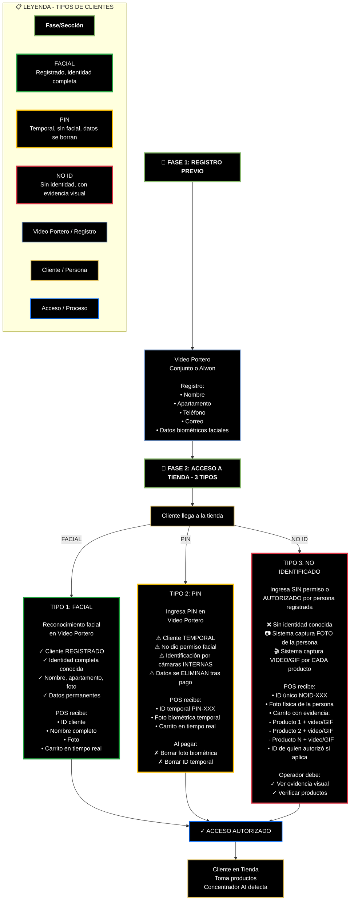

# Alwon POS - Flujo con 3 Tipos de Acceso
## Diagrama de los Tres Tipos de Acceso a la Tienda

Este diagrama detalla los tres tipos diferentes de acceso que un cliente puede usar para ingresar a la tienda automatizada, con sus características específicas y el manejo de datos en cada caso.



## Descripción de los 3 Tipos de Acceso

### ✅ TIPO 1: RECONOCIMIENTO FACIAL (Verde)

**Características:**
- Cliente **REGISTRADO** previamente en el sistema
- Identidad **completa y conocida**
- Acceso mediante reconocimiento facial en el video portero
- Datos **permanentes** en el sistema

**Información del Cliente:**
- ID único del cliente
- Nombre completo
- Número de apartamento
- Teléfono y correo
- Foto de perfil

**Lo que recibe el POS:**
```
✓ ID cliente
✓ Nombre completo
✓ Foto de perfil
✓ Carrito actualizado en tiempo real
```

**Ventajas:**
- Proceso más rápido
- Mejor experiencia de usuario
- Datos completos para fidelización
- Historial de compras disponible

---

### ⚠️ TIPO 2: PIN TEMPORAL (Amarillo)

**Características:**
- Cliente **TEMPORAL** que no quiso dar permiso facial
- Ingresa mediante PIN en el video portero
- Identificación posterior mediante cámaras **INTERNAS** de la tienda
- Datos se **ELIMINAN** completamente tras el pago

**Información del Cliente:**
- ID temporal (formato: `PIN-XXX`)
- Foto biométrica capturada internamente (temporal)
- Sin nombre ni datos personales permanentes

**Lo que recibe el POS:**
```
⚠ ID temporal (PIN-XXX)
⚠ Foto biométrica temporal
⚠ Carrito en tiempo real
```

**Proceso de Eliminación (Al completar pago):**
```
1. Transaction completed
2. ✗ Borrar foto biométrica
3. ✗ Borrar ID temporal
4. ✗ Limpiar caché de reconocimiento
5. ✓ Mantener solo: transacción + items comprados (anónimos)
```

**Importante:**
- Cumple con privacidad del cliente
- No se almacena información personal
- Solo se guarda: fecha, hora, productos, monto
- Sin asociación a identidad

---

### ❌ TIPO 3: NO IDENTIFICADO (Rojo)

**Características:**
- Persona **SIN PERMISO** de acceso o
- Persona **AUTORIZADA** temporalmente por un residente registrado
- **Sin identidad conocida** por el sistema
- Máximo nivel de **evidencia visual** capturada

**Captura del Sistema:**
- 📷 **Foto física** de la persona (cara completa)
- 🎬 **Video/GIF por cada producto** que toma
- 📹 Evidencia completa del recorrido

**Lo que recibe el POS:**
```
❌ ID único (NOID-XXX)
📷 Foto física de la persona
🛒 Carrito con evidencia detallada:
   • Producto 1: [Imagen] + [Video/GIF de toma]
   • Producto 2: [Imagen] + [Video/GIF de toma]
   • Producto N: [Imagen] + [Video/GIF de toma]
👤 ID de quien autorizó (si fue autorizado por residente)
```

**Responsabilidad del Operador:**
```
✓ Revisar evidencia visual de cada producto
✓ Confirmar que los productos coinciden
✓ Verificar la identidad visual con la foto
✓ Aprobar o rechazar la transacción
```

**Casos de Uso:**
1. **Visitantes autorizados**: Amigo/familiar de un residente
2. **Personal de mantenimiento**: Autorizado temporalmente
3. **Entrega de paquetes**: Personal externo con permiso específico
4. **Acceso no autorizado**: Persona que ingresó sin permiso (requiere investigación)

---

## Comparación de Tipos

| Aspecto | TIPO 1: FACIAL | TIPO 2: PIN | TIPO 3: NO ID |
|---------|----------------|-------------|---------------|
| **Identidad** | ✅ Completa | ⚠️ Temporal | ❌ Desconocida |
| **Registro Previo** | ✅ Requerido | ⚠️ Opcional | ❌ No necesario |
| **Datos Permanentes** | ✅ Sí | ❌ No (se borran) | ❌ Solo evidencia |
| **Foto en POS** | ✅ Perfil | ⚠️ Biométrica temporal | 📷 Foto física capturada |
| **Evidencia Visual** | ❌ No necesaria | ❌ No necesaria | ✅ Video por producto |
| **Verificación Operador** | Básica | Básica | ⚠️ **Exhaustiva** |
| **Historial** | ✅ Completo | ❌ Anónimo | ❌ Solo transacción |
| **Autorización Acceso** | Auto | Auto | 👤 Via residente |

## Flujo Después del Acceso

Una vez que el cliente accede (sin importar el tipo), el flujo **continúa igual** para todos:

```
1. Cliente en tienda → Toma productos
2. Concentrador AI → Detecta productos y cliente
3. Webhook/API → Envía datos a POS
4. POS → Muestra cliente activo con su carrito
5. Operador → Selecciona cliente cuando se acerca
6. Operador → Confirma identidad (visual)
7. POS → Muestra carrito completo
8. Cliente → Procesa pago
9. Sistema → Completa transacción
```

**Diferencia según tipo:**
- **TIPO 1 (FACIAL)**: Verificación rápida, datos completos
- **TIPO 2 (PIN)**: Verificación normal, datos se eliminan al finalizar
- **TIPO 3 (NO ID)**: Verificación exhaustiva con evidencia visual por producto

## Seguridad y Privacidad

### 🔒 Cumplimiento de Privacidad
- **TIPO 1**: Usuario consiente explícitamente el almacenamiento de datos
- **TIPO 2**: Datos temporales eliminados automáticamente post-pago
- **TIPO 3**: Evidencia almacenada solo para validación de transacción

### 📹 Retención de Evidencia Visual
- **TIPO 1 y 2**: Videos no se almacenan (confianza en IA)
- **TIPO 3**: Videos/GIFs almacenados por periodo definido (ej: 30 días) para auditoría

### 🛡️ Niveles de Verificación
1. **TIPO 1**: Baja - Cliente conocido y registrado
2. **TIPO 2**: Media - Cliente temporal pero acceso legítimo
3. **TIPO 3**: Alta - Requiere evidencia completa y verificación manual

---

**Versión**: 1.0  
**Fecha**: Diciembre 2025  
**Proyecto**: Alwon POS - Sistema de Acceso Multi-Tipo
