# Alwon POS - Flujo de Proceso Completo
## Diagrama de Flujo de la Tienda Automatizada

Este diagrama muestra el flujo completo desde el registro del cliente hasta el pago exitoso en la tienda automatizada Alwon.

```mermaid
flowchart TB
    %% Estilos
    classDef cliente fill:#000,stroke:#d6b656,stroke-width:2px,color:#fff
    classDef videoPortero fill:#000,stroke:#6c8ebf,stroke-width:2px,color:#fff
    classDef concentradorAI fill:#000,stroke:#9673a6,stroke-width:2px,color:#fff
    classDef pos fill:#000,stroke:#b85450,stroke-width:2px,color:#fff
    classDef operador fill:#000,stroke:#d79b00,stroke-width:2px,color:#fff
    classDef exito fill:#000,stroke:#28a745,stroke-width:2px,color:#fff
    classDef advertencia fill:#000,stroke:#ffc107,stroke-width:2px,color:#fff
    classDef error fill:#000,stroke:#dc3545,stroke-width:2px,color:#fff
    classDef proceso fill:#000,stroke:#0d6efd,stroke-width:2px,color:#fff
    classDef fase fill:#000,stroke:#82b366,stroke-width:3px,color:#fff,font-weight:bold
    
    %% FASE 1: REGISTRO PREVIO
    FASE1["🔐 FASE 1: REGISTRO PREVIO"]:::fase
    
    REGISTRO["Video Portero#10;Conjunto o Alwon#10;#10;Registro:#10;• Nombre#10;• Apartamento#10;• Teléfono#10;• Correo#10;• Datos biométricos"]:::videoPortero
    
    %% FASE 2: ACCESO 3 TIPOS
    FASE2["🚪 FASE 2: ACCESO - 3 TIPOS"]:::fase
    
    LLEGA["Cliente llega#10;a la tienda"]:::cliente
    
    TIPO1["TIPO 1: FACIAL#10;Reconocimiento facial#10;Video Portero#10;#10;✓ Identidad completa#10;✓ Datos permanentes"]:::exito
    
    TIPO2["TIPO 2: PIN#10;Ingresa PIN#10;Video Portero#10;#10;⚠ ID temporal#10;⚠ Datos se eliminan"]:::advertencia
    
    TIPO3["TIPO 3: NO ID#10;Sin permiso#10;#10;❌ Sin identidad#10;📷 Foto + videos"]:::error
    
    AUTORIZADO["✓ Acceso Autorizado"]:::proceso
    
    %% FASE 3: COMPRA
    FASE3["🛒 FASE 3: COMPRA"]:::fase
    
    EN_TIENDA["Cliente en tienda#10;Toma productos"]:::cliente
    
    CONCENTRADOR["CONCENTRADOR AI#10;Sistema Externo#10;#10;Detecta:#10;• Productos tomados#10;• Cliente que toma#10;#10;Envía a POS:#10;• Artículos#10;• Info cliente#10;• Datos biométricos"]:::concentradorAI
    
    %% FASE 4: POS EN TIEMPO REAL
    FASE4["📱 FASE 4: POS EN TIEMPO REAL"]:::fase
    
    POS_RECIBE["POS - Tablet Android#10;#10;Recibe en tiempo real:#10;✓ Clientes activos#10;✓ Fotos clientes#10;✓ Artículos por cliente#10;✓ Datos biométricos"]:::pos
    
    POS_VISTA["Vista POS:#10;#10;Lista de clientes activos:#10;📷 Juan Pérez - 3 items#10;📷 María López - 5 items#10;📷 Carlos Ruiz - 2 items"]:::pos
    
    %% FASE 5: CHECKOUT
    FASE5["💳 FASE 5: CHECKOUT"]:::fase
    
    ACERCA_POS["Cliente se acerca#10;al POS a pagar"]:::cliente
    
    OP_SELECCIONA["1. Operador SELECCIONA#10;cliente de la lista"]:::operador
    
    OP_CONFIRMA["2. Operador CONFIRMA#10;identidad del cliente#10;compara foto vs persona"]:::operador
    
    MUESTRA_CARRITO["3. POS MUESTRA CARRITO#10;#10;Artículos del cliente:#10;• Coca Cola x2 - $4,000#10;• Pan integral - $3,500#10;• Leche - $5,200#10;#10;Total: $12,700"]:::exito
    
    %% FASE 6: AJUSTE MANUAL
    FASE6["🔧 FASE 6: AJUSTE MANUAL"]:::fase
    
    DECISION{"¿Faltan artículos?#10;IA en entrenamiento"}:::advertencia
    
    AGREGA_MANUAL["SÍ#10;#10;Trabajador AGREGA#10;artículos faltantes#10;manualmente"]:::error
    
    TODO_OK["NO - Todo correcto"]:::exito
    
    %% PAGO
    PROCESAR_PAGO["4. PROCESAR PAGO#10;#10;Método de pago:#10;□ Tarjeta Débito#10;□ PSE#10;#10;Procesar Pago"]:::proceso
    
    PAGO_EXITOSO["✓ PAGO EXITOSO#10;#10;• Actualizar inventario#10;• Generar recibo#10;• Cerrar sesión cliente"]:::exito
    
    %% FLUJO PRINCIPAL
    FASE1 --> REGISTRO
    REGISTRO --> FASE2
    FASE2 --> LLEGA
    
    LLEGA -->|Facial| TIPO1
    LLEGA -->|PIN| TIPO2
    LLEGA -->|No ID| TIPO3
    
    TIPO1 --> AUTORIZADO
    TIPO2 --> AUTORIZADO
    TIPO3 --> AUTORIZADO
    
    AUTORIZADO --> FASE3
    FASE3 --> EN_TIENDA
    EN_TIENDA -.->|Detecta| CONCENTRADOR
    
    CONCENTRADOR ==>|Webhook/API| FASE4
    FASE4 --> POS_RECIBE
    POS_RECIBE --> POS_VISTA
    
    EN_TIENDA --> ACERCA_POS
    POS_VISTA --> FASE5
    FASE5 --> OP_SELECCIONA
    OP_SELECCIONA --> OP_CONFIRMA
    OP_CONFIRMA --> MUESTRA_CARRITO
    
    MUESTRA_CARRITO -.-> FASE6
    FASE6 -.-> DECISION
    
    DECISION -->|SÍ| AGREGA_MANUAL
    AGREGA_MANUAL -.->|Actualiza| MUESTRA_CARRITO
    
    DECISION -->|NO| TODO_OK
    TODO_OK --> PROCESAR_PAGO
    
    PROCESAR_PAGO ==>|✓| PAGO_EXITOSO
    
    %% LEYENDA VISUAL
    subgraph LEYENDA["📋 LEYENDA"]
        L0["Fase/Sección"]:::fase
        L1["Cliente/Persona"]:::cliente
        L2["Video Portero"]:::videoPortero
        L3["Concentrador AI"]:::concentradorAI
        L4["POS - Nuestro Sistema"]:::pos
        L5["Acción Operador"]:::operador
        L6["Éxito/Confirmación"]:::exito
        L7["Advertencia/Temporal"]:::advertencia
        L8["Error/Sin ID"]:::error
        L9["Proceso Pago"]:::proceso
    end
```



## Descripción de las Fases

### 🔐 Fase 1: Registro Previo
El cliente se registra en el sistema de video portero (puede ser del conjunto residencial o de Alwon) proporcionando:
- Información personal (nombre, apartamento, teléfono, correo)
- Datos biométricos para reconocimiento facial

### 🚪 Fase 2: Acceso (3 Tipos)
El cliente puede acceder a la tienda de tres maneras:

#### ✅ Tipo 1: Reconocimiento Facial
- Sistema reconoce automáticamente al cliente
- Identidad completa disponible
- Datos permanentes en el sistema

#### ⚠️ Tipo 2: PIN
- Cliente ingresa un código PIN
- ID temporal asignado
- Datos se eliminan después de la transacción

#### ❌ Tipo 3: Sin Identificación
- Cliente sin permiso previo o autorizado temporalmente
- No hay identidad asociada
- Sistema captura fotos y videos como evidencia

### 🛒 Fase 3: Compra
1. Cliente entra a la tienda y toma productos
2. **Concentrador AI** (sistema externo) detecta:
   - Qué productos toma el cliente
   - Quién está tomando los productos (mediante reconocimiento)
3. Información enviada en tiempo real al POS

### 📱 Fase 4: POS en Tiempo Real
El sistema POS (tablet Android) recibe mediante webhook/API:
- Lista de clientes activos en la tienda
- Fotos de cada cliente
- Artículos que cada cliente ha tomado
- Datos biométricos para validación

**Vista del POS:**
```
Clientes Activos:
[📷] Juan Pérez - 3 items
[📷] María López - 5 items  
[📷] Carlos Ruiz - 2 items
```

### 💳 Fase 5: Checkout
1. **Cliente se acerca** al POS para pagar
2. **Operador selecciona** al cliente de la lista
3. **Operador confirma** identidad (compara foto con persona física)
4. **POS muestra el carrito** completo con todos los artículos:
   ```
   • Coca Cola x2 - $4,000
   • Pan integral - $3,500
   • Leche deslactosada - $5,200
   ─────────────────────────
   Total: $12,700
   ```

### 🔧 Fase 6: Ajuste Manual
**Mientras la IA está en entrenamiento:**

Si el operador detecta que faltan artículos:
- ✅ **SÍ**: Trabajador agrega manualmente los artículos faltantes
- ↩️ Carrito se actualiza con los nuevos items
- 🔄 Se vuelve a mostrar el carrito completo

Si todo está correcto:
- ✅ **NO**: Se procede al pago

### 💰 Pago y Finalización
1. **Procesar pago** con método seleccionado:
   - Tarjeta de débito
   - PSE (Pagos Seguros en Línea)

2. **Pago exitoso**:
   - ✅ Inventario actualizado
   - 📄 Recibo generado
   - 🔒 Sesión del cliente cerrada

## Leyenda de Colores

| Color | Significado |
|-------|-------------|
| 🟡 **Amarillo** (#d6b656) | Cliente/Persona |
| 🔵 **Azul** (#6c8ebf) | Sistema Video Portero |
| 🟣 **Morado** (#9673a6) | Concentrador AI (Sistema Externo) |
| 🔴 **Rojo** (#b85450) | POS (Nuestro Sistema) |
| 🟠 **Naranja** (#d79b00) | Acción del Operador |
| 🟢 **Verde** (#28a745) | Éxito/Confirmación |
| 🟡 **Amarillo Claro** (#ffc107) | Advertencia/Temporal |
| 🔴 **Rojo Oscuro** (#dc3545) | Error/Sin Identificación |
| 🔵 **Azul Claro** (#0d6efd) | Proceso de Pago |
| 🟢 **Verde Claro** (#82b366) | Separadores de Fase |

## Tipos de Conexiones

- **Flecha sólida** (→) - Flujo principal del proceso
- **Flecha punteada** (-.->) - Detección/Monitoreo
- **Flecha gruesa** (==>) - Transferencia de datos importante (API/Webhook)

## Características Clave del Flujo

### 🔄 Tiempo Real
- El concentrador AI envía datos en tiempo real al POS
- El operador ve el carrito actualizándose mientras el cliente compra

### 🎯 Validación Múltiple
1. **Sistema AI**: Detección automática de productos
2. **Operador**: Confirmación visual de identidad
3. **Ajuste manual**: Corrección si la IA falla (durante entrenamiento)

### 🛡️ Seguridad
- Múltiples métodos de acceso con diferentes niveles de seguridad
- Captura de evidencia fotográfica y de video
- Confirmación física del operador antes del pago

### 📊 Trazabilidad
- Registro completo desde el acceso hasta el pago
- Audit trail de todas las acciones del operador
- Evidencia multimedia para clientes no identificados

---

**Versión**: 1.0  
**Fecha**: Diciembre 2025  
**Proyecto**: Alwon POS - Tienda Automatizada
