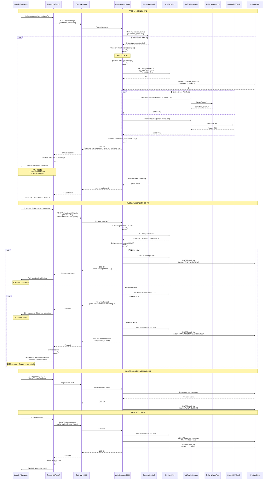
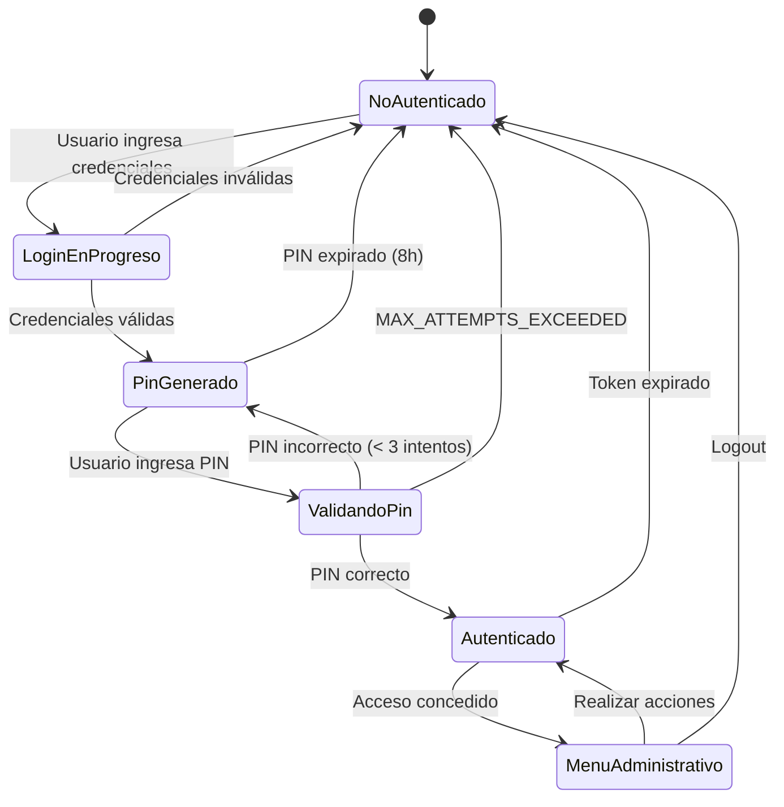

# Flujo de Autenticación de Operador - Alwon POS

## Versión 1.0 (25 Diciembre 2025)

Este documento describe el flujo completo del sistema de autenticación de operadores con PIN temporal de 2 niveles.

---

## 🎯 Resumen del Sistema

**Tipo:** Autenticación de 2 niveles (Usuario/Password + PIN)  
**Tecnología:** Spring Boot + Redis + Twilio + SendGrid  
**Seguridad:** BCrypt + JWT + TTL automático  
**Tiempo de vida:** 8 horas por PIN  

---

## 📊 Flujo Completo de Autenticación



---

## 🔐 Detalles de Seguridad

### 1. Pin Generation
```java
// Genera números de 100000 a 999999
Random random = new Random();
int pin = 100000 + random.nextInt(900000);
```

### 2. PIN Storage en Redis
**Key:** `pin:operator:{operatorId}`

**Value (JSON):**
```json
{
  "pinHash": "$2a$10$N9qo8uLOickgx2ZMRZoMye...",
  "attempts": 0,
  "createdAt": "2025-12-25T12:30:00",
  "expiresAt": "2025-12-25T20:30:00"
}
```

**TTL:** 28800 segundos (8 horas)

### 3. PIN Validation
```java
// BCrypt compare
boolean isValid = passwordEncoder.matches(pin, storedPinHash);
```

### 4. JWT Token
**Claims:**
```json
{
  "sub": "123",
  "username": "carlos.martinez",
  "role": "OPERATOR",
  "iat": 1703512800,
  "exp": 1703541600
}
```

**Expiración:** 8 horas (28800000 ms)

---

## 📱 Notificaciones

### WhatsApp (Twilio)
**Plantilla:**
```
🔐 *Alwon POS*

Hola Carlos Martínez,

Tu PIN temporal es: *472915*

Este PIN es válido por 8 horas.

No compartas este código con nadie.
```

### Email (SendGrid)
**HTML Template:**
- Logo de Alwon POS
- PIN destacado con tipografía grande
- Validez de 8 horas
- Aviso de seguridad

**Máscaras de Privacidad:**
- Phone: `+57 300 123 4567` → `***-***-4567`
- Email: `carlos@alwon.com` → `c***@alwon.com`

---

## ⚠️ Manejo de Errores

### Error 1: Credenciales Inválidas
**Status:** 401 Unauthorized  
**Response:**
```json
{
  "success": false,
  "error": "INVALID_CREDENTIALS",
  "message": "Usuario o contraseña incorrectos"
}
```

### Error 2: PIN Incorrecto (< 3 intentos)
**Status:** 401 Unauthorized  
**Response:**
```json
{
  "success": false,
  "valid": false,
  "attemptsRemaining": 2,
  "message": "PIN incorrecto"
}
```

### Error 3: Máximo de Intentos
**Status:** 429 Too Many Requests  
**Response:**
```json
{
  "success": false,
  "error": "MAX_ATTEMPTS_EXCEEDED",
  "message": "Máximo de intentos alcanzado. Por favor inicia sesión nuevamente.",
  "requiresLogin": true
}
```

### Error 4: PIN Expirado
**Status:** 401 Unauthorized  
**Response:**
```json
{
  "success": false,
  "error": "PIN_EXPIRED",
  "message": "PIN expirado. Inicia sesión nuevamente.",
  "requiresLogin": true
}
```

### Error 5: Rate Limit Excedido
**Status:** 429 Too Many Requests  
**Response:**
```json
{
  "error": "RATE_LIMIT_EXCEEDED",
  "message": "Demasiadas solicitudes. Intenta de nuevo en 60 segundos."
}
```

**Límite:** 5 intentos por minuto

---

## 🔄 Estados del Sistema



---

## ⏱️ Tiempos y TTLs

| Componente | Duración | Notas |
|------------|----------|-------|
| **PIN TTL** | 8 horas | Expira automáticamente en Redis |
| **JWT Token** | 8 horas | Mismo tiempo que el PIN |
| **Auto-cierre PIN Display** | 5 segundos | Frontend cierra modal automáticamente |
| **Rate Limit** | 5 req/min | Por IP en endpoint login |
| **Timeout Sistema Central** | 5 segundos | Timeout para validación de usuario |
| **Timeout Redis** | 60 segundos | Configurado en connection factory |

---

## 📊 Audit Log

Todas las acciones se registran en `auth.audit_log`:

**Acciones registradas:**
- `LOGIN` - Login exitoso
- `LOGIN_FAILED` - Credenciales inválidas
- `PIN_GENERATED` - PIN generado
- `PIN_VALIDATED` - PIN validado correctamente
- `PIN_FAILED` - Intento de PIN incorrecto
- `MAX_ATTEMPTS_EXCEEDED` - Máximo de intentos alcanzado
- `LOGOUT` - Cierre de sesión
- `VIEW_SALES` - Ver ventas del día
- `CLOSE_DAY` - Cierre del día
- `VIEW_LOSSES` - Ver pérdidas del día

**Estructura del log:**
```sql
INSERT INTO auth.audit_log (
  operator_id,
  action,
  entity_type,
  entity_id,
  details,
  ip_address,
  user_agent,
  success,
  created_at
) VALUES (
  123,
  'PIN_VALIDATED',
  'PIN',
  NULL,
  '{"attempts": 1}',
  '192.168.1.100',
  'Mozilla/5.0...',
  true,
  NOW()
);
```

---

## 🚀 Endpoints del API

### 1. POST `/api/auth/login`
**Descripción:** Login y generación de PIN  
**Auth:** No (público)  
**Rate Limit:** 5 req/min  

### 2. POST `/api/auth/validate-pin`
**Descripción:** Validación de PIN  
**Auth:** Sí (JWT Bearer)  
**Rate Limit:** 10 req/min  

### 3. POST `/api/auth/logout`
**Descripción:** Cierre de sesión  
**Auth:** Sí (JWT Bearer)  
**Rate Limit:** No  

### 4. GET `/api/auth/session`
**Descripción:** Verificar sesión activa  
**Auth:** Sí (JWT Bearer)  
**Rate Limit:** No  

---

## 🔧 Configuración Requerida

### Variables de Entorno

```bash
# Sistema Central
CENTRAL_SYSTEM_URL=https://central.alwon.com
CENTRAL_API_KEY=your_api_key

# Redis
REDIS_HOST=localhost
REDIS_PORT=6379
REDIS_PASSWORD=your_password

# Twilio (WhatsApp)
TWILIO_ACCOUNT_SID=ACxxxxxxxxx
TWILIO_AUTH_TOKEN=your_token
TWILIO_WHATSAPP_FROM=whatsapp:+14155238886
TWILIO_ENABLED=true

# SendGrid (Email)
SENDGRID_API_KEY=SG.xxxxxxxxx
SENDGRID_FROM_EMAIL=noreply@alwon.com
SENDGRID_ENABLED=true

# JWT
JWT_SECRET=change_this_in_production
JWT_EXPIRATION_MS=28800000

# PIN
PIN_EXPIRATION_HOURS=8
MAX_PIN_ATTEMPTS=3
```

---

## 📈 Métricas de Performance

| Operación | Tiempo Esperado | Notas |
|-----------|----------------|-------|
| Login (completo) | < 2 segundos | Incluye validación + PIN + notificaciones |
| Validación Sistema Central | < 500ms | Depende de red |
| Generación PIN | < 10ms | Local |
| Redis SET/GET | < 1ms | Red local |
| Notificación WhatsApp | 1-3 segundos | Async, no bloquea |
| Notificación Email | 1-2 segundos | Async, no bloquea |
| Validación PIN | < 50ms | BCrypt + Redis |

---

**Documento actualizado:** 25 de Diciembre, 2025  
**Versión:** 1.0  
**Autor:** Alwon POS Team
