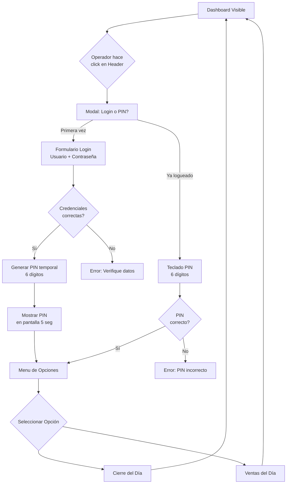

# US-FRONTEND-003: Sistema de Autenticación de Operador con PIN

## 📋 Metadata
- **ID**: US-FRONTEND-003
- **Tipo**: User Story - Frontend Authentication
- **Prioridad**: Alta
- **Fecha**: 25 de Diciembre, 2025
- **Relacionado con**: Dashboard, Operator Management

---

## 👤 Historia de Usuario

**Como** operador de la tienda Alwon,  
**Quiero** poder autenticarme con usuario/contraseña y luego usar un PIN de 6 dígitos,  
**Para** acceder rápidamente a opciones administrativas (cierre de día, reportes) sin que clientes puedan acceder.

---

## 🎯 Problema a Resolver

### Contexto
El dashboard del POS debe estar siempre visible mostrando clientes activos, pero el operador necesita:
1. Poder realizar acciones administrativas en cualquier momento
2. Evitar que clientes accedan a estas opciones
3. No tener que escribir usuario/contraseña cada vez (demasiado lento)

### Solución Propuesta: Sistema de Autenticación de 2 Niveles

#### **Nivel 1: Login Completo (Primera Vez en el Turno)**
- Usuario + Contraseña
- Se hace 1 vez al inicio del turno
- Genera un PIN temporal de 6 dígitos

#### **Nivel 2: PIN Rápido (Durante el Turno)**  
- Solo 6 dígitos numéricos
- Acceso rápido a opciones administrativas
- Se puede ingresar con teclado numérico en pantalla

---

## 🔐 Flujo de Autenticación

### Flujo Completo



---

## 🎨 Diseño de UI

### 1. Botón de Autenticación en Header

**Ubicación**: Esquina superior derecha del Header

**Estados:**
- **No autenticado**: 
  ```
  👤 Operador
  ```
  - Color: Gris
  - Tooltip: "Iniciar sesión"

- **Autenticado**: 
  ```
  ✓ Carlos M.
  ```
  - Color: Verde
  - Tooltip: "Carlos Martínez - PIN activo"
  - Muestra nombre del operador

### 2. Modal de Login (Primera Vez)

```
┌─────────────────────────────────────────┐
│  🔐 Autenticación de Operador           │
├─────────────────────────────────────────┤
│                                         │
│  Usuario                                │
│  ┌─────────────────────────────────┐   │
│  │ carlos.martinez                 │   │
│  └─────────────────────────────────┘   │
│                                         │
│  Contraseña                             │
│  ┌─────────────────────────────────┐   │
│  │ ••••••••                        │   │
│  └─────────────────────────────────┘   │
│                                         │
│  ┌───────────┐  ┌───────────┐          │
│  │ Cancelar  │  │ Ingresar  │          │
│  └───────────┘  └───────────┘          │
│                                         │
└─────────────────────────────────────────┘
```

### 3. Pantalla de PIN Generado

```
┌─────────────────────────────────────────┐
│  ✅ Login Exitoso                        │
├─────────────────────────────────────────┤
│                                         │
│  Bienvenido, Carlos Martínez            │
│                                         │
│  Tu PIN temporal es:                    │
│                                         │
│  ┌───────────────────────────────────┐ │
│  │                                   │ │
│  │          🔢  4  7  2  9  1  5     │ │
│  │                                   │ │
│  └───────────────────────────────────┘ │
│                                         │
│  🕐 Memoriza este PIN                   │
│                                         │
│  ✓ Enviado a tu WhatsApp: ***-***-4567 │
│  ✓ Enviado a tu Email: c***@***.com    │
│                                         │
│  Auto-cierre en 5 segundos...           │
│                                         │
│  ┌───────────────────────────────────┐ │
│  │        Continuar (Enter)          │ │
│  └───────────────────────────────────┘ │
│                                         │
└─────────────────────────────────────────┘
```

### 4. Teclado Numérico para PIN

```
┌─────────────────────────────────────────┐
│  🔢 Ingresa tu PIN                       │
├─────────────────────────────────────────┤
│                                         │
│  PIN: ● ● ● ● ● ●                      │
│                                         │
│  ┌───────┬───────┬───────┐            │
│  │   1   │   2   │   3   │            │
│  ├───────┼───────┼───────┤            │
│  │   4   │   5   │   6   │            │
│  ├───────┼───────┼───────┤            │
│  │   7   │   8   │   9   │            │
│  ├───────┼───────┼───────┤            │
│  │   ←   │   0   │   ✓   │            │
│  └───────┴───────┴───────┘            │
│                                         │
│  ┌─────────────────┐                   │
│  │    Cancelar     │                   │
│  └─────────────────┘                   │
│                                         │
└─────────────────────────────────────────┘
```

### 5. Menú de Opciones Administrativas

```
┌─────────────────────────────────────────┐
│  ⚙️ Opciones Administrativas             │
├─────────────────────────────────────────┤
│                                         │
│  Operador: Carlos Martínez              │
│  Hora: 12:00 PM                         │
│                                         │
│  ┌───────────────────────────────────┐ │
│  │  💰 Cierre del Día                │ │
│  │                                   │ │
│  │  Finalizar turno y generar        │ │
│  │  reporte de ventas                │ │
│  └───────────────────────────────────┘ │
│                                         │
│  ┌───────────────────────────────────┐ │
│  │  📊 Ventas del Día                │ │
│  │                                   │ │
│  │  Ver reporte de ventas            │ │
│  │  acumuladas hasta ahora           │ │
│  └───────────────────────────────────┘ │
│                                         │
│  ┌───────────┐                         │
│  │  Cerrar   │                         │
│  └───────────┘                         │
│                                         │
└─────────────────────────────────────────┘
```

---

## 🔄 Ciclo de Vida del PIN

### Generación
- Se genera automáticamente al hacer login exitoso
- 6 dígitos numéricos aleatorios (000000 - 999999)
- Se muestra en pantalla por 5 segundos
- El operador debe memorizarlo

### Validez
- **Duración**: Válido durante todo el turno
- **Expiración**: 
  - 8 horas de inactividad
  - Cierre manual de sesión
  - Cierre del día
- **Renovación**: No se renueva automáticamente

### Seguridad
- PIN diferente en cada login
- Se almacena hasheado en backend
- Después de 3 intentos fallidos, requiere login completo
- No se puede recuperar (operador debe volver a loguearse)

---

## 📊 Criterios de Aceptación

### AC1: Botón de Operador en Header
- [ ] Botón visible en esquina superior derecha
- [ ] Estado "No autenticado" muestra 👤 Operador
- [ ] Estado "Autenticado" muestra ✓ y nombre del operador
- [ ] Click abre modal de autenticación

### AC2: Modal de Login
- [ ] Campos: Usuario y Contraseña
- [ ] Validación en tiempo real
- [ ] Mensaje de error si credenciales incorrectas
- [ ] Botón "Cancelar" cierra modal
- [ ] Botón "Ingresar" envía credenciales al backend

### AC3: Generación de PIN
- [ ] PIN de 6 dígitos numéricos
- [ ] Se muestra en pantalla grande por 5 segundos
- [ ] **Se envía por WhatsApp al número del operador**
- [ ] **Se envía por Email al correo del operador**
- [ ] Mensaje claro: "Memoriza este PIN" + "Enviado a tu WhatsApp/Email"
- [ ] Cuenta regresiva visible
- [ ] Auto-cierre después de 5 segundos

### AC4: Teclado Numérico
- [ ] Teclado 0-9 con botones grandes
- [ ] Botón de borrar (←)
- [ ] Botón de confirmar (✓)
- [ ] Muestra PIN como ●●●●●● mientras se escribe
- [ ] Se activa confirmar solo cuando hay 6 dígitos

### AC5: Validación de PIN
- [ ] Verifica PIN contra backend
- [ ] Mensaje de error si PIN incorrecto
- [ ] Contador de intentos (máximo 3)
- [ ] Después de 3 intentos, requiere login completo
- [ ] Si correcto, muestra menú de opciones

### AC6: Menú de Opciones
- [ ] Opción 1: "Cierre del Día"
- [ ] Opción 2: "Ventas del Día"
- [ ] Muestra nombre del operador
- [ ] Muestra hora actual
- [ ] Botón "Cerrar" vuelve al dashboard

### AC7: Seguridad
- [ ] PIN expira después de 8 horas
- [ ] PIN se invalida al cerrar sesión
- [ ] PIN se hashea antes de enviarse al backend
- [ ] No se puede acceder a opciones sin PIN válido

---

## 🔧 Implementación Técnica

### Frontend

#### 1. Zustand Store: `useAuthStore.ts`

```typescript
interface AuthState {
  operator: Operator | null;
  isPinActive: boolean;
  pinAttempts: number;
  
  // Actions
  login: (username: string, password: string) => Promise<{pin: string}>;
  validatePin: (pin: string) => Promise<boolean>;
  logout: () => void;
  incrementPinAttempts: () => void;
  resetPinAttempts: () => void;
}
```

#### 2. Componentes

- `OperatorButton.tsx` - Botón en Header
- `LoginModal.tsx` - Modal de login
- `PinDisplay.tsx` - Pantalla de PIN generado
- `PinKeypad.tsx` - Teclado numérico
- `AdminOptionsMenu.tsx` - Menú de opciones

#### 3. Servicios API

```typescript
// authApi.ts
export const authApi = {
  login: async (username: string, password: string) => {
    // POST /api/auth/login
    // Returns: { operator, token, pin }
  },
  
  validatePin: async (pin: string) => {
    // POST /api/auth/validate-pin
    // Returns: { valid: boolean }
  },
  
  logout: async () => {
    // POST /api/auth/logout
  }
};
```

### Backend Endpoints

```java
// AuthController.java

@PostMapping("/auth/login")
public ResponseEntity<LoginResponse> login(@RequestBody LoginRequest request) {
  // 1. Validar credenciales
  // 2. Generar PIN de 6 dígitos
  // 3. Hashear PIN y guardar en Redis con TTL 8h
  // 4. Retornar: operator, token, pin (sin hashear, solo esta vez)
}

@PostMapping("/auth/validate-pin")
public ResponseEntity<PinValidationResponse> validatePin(
  @RequestBody PinValidationRequest request
) {
  // 1. Hashear PIN recibido
  // 2. Comparar con hash almacenado
  // 3. Incrementar contador de intentos si falla
  // 4. Invalidar después de 3 intentos
  // 5. Retornar: valid, attemptsRemaining
}

@PostMapping("/auth/logout")
public ResponseEntity<Void> logout() {
  // 1. Invalidar PIN en Redis
  // 2. Invalidar token JWT
}
```

### Base de Datos

```sql
-- Operators table (ya existe en auth-service)
CREATE TABLE IF NOT EXISTS auth.operators (
  operator_id SERIAL PRIMARY KEY,
  username VARCHAR(50) UNIQUE NOT NULL,
  password_hash VARCHAR(255) NOT NULL,
  full_name VARCHAR(100) NOT NULL,
  email VARCHAR(100),
  role VARCHAR(20) DEFAULT 'OPERATOR',
  active BOOLEAN DEFAULT true,
  created_at TIMESTAMP DEFAULT NOW()
);

-- PIN tracking in Redis (temporal)
Key: pin:{operator_id}
Value: {
  pin_hash: string,
  attempts: number,
  expires_at: timestamp
}
TTL: 8 hours
```

---

## 🎯 Ventajas de este Sistema

### Para el Operador
✅ Login completo solo 1 vez al inicio del turno  
✅ PIN rápido (6 dígitos) para accesos frecuentes  
✅ Teclado numérico grande y fácil de usar  
✅ No necesita recordar contraseña compleja todo el tiempo  

### Para la Seguridad
✅ PIN diferente en cada turno  
✅ Expira automáticamente  
✅ Límite de intentos fallidos  
✅ No se puede adivinar fácilmente (1 millón de combinaciones)  

### Para la UX
✅ Dashboard siempre visible  
✅ Acceso rápido a opciones administrativas  
✅ No interrumpe el flujo de trabajo  
✅ Clientes no pueden acceder por accidente  

---

## 📝 Notas de Implementación

### Orden de Desarrollo
1. Backend: Endpoints de autenticación
2. Frontend: useAuthStore
3. Frontend: LoginModal + validación
4. Frontend: Generación y display de PIN
5. Frontend: Teclado numérico
6. Frontend: Menú de opciones
7. Integración completa

### Consideraciones
- El PIN se muestra **solo una vez** al generarse
- Si el operador lo olvida, debe volver a loguearse
- Los 3 intentos fallidos reset requieren login completo
- El PIN es independiente del token JWT (que se usa para APIs)

---

## 🚀 Próximos Pasos

Después de implementar este sistema básico, se puede extender con:
- [ ] Opción "Olvidé mi PIN" con verificación por email/SMS
- [ ] Múltiples operadores en paralelo (turnos compartidos)
- [ ] Logs de auditoría de accesos administrativos
- [ ] Más opciones en el menú (reportes, configuración, etc.)
- [ ] Roles diferenciados (Operador vs Supervisor)

---

**Documento creado por**: Antigravity AI  
**Fecha**: 25 de Diciembre, 2025
