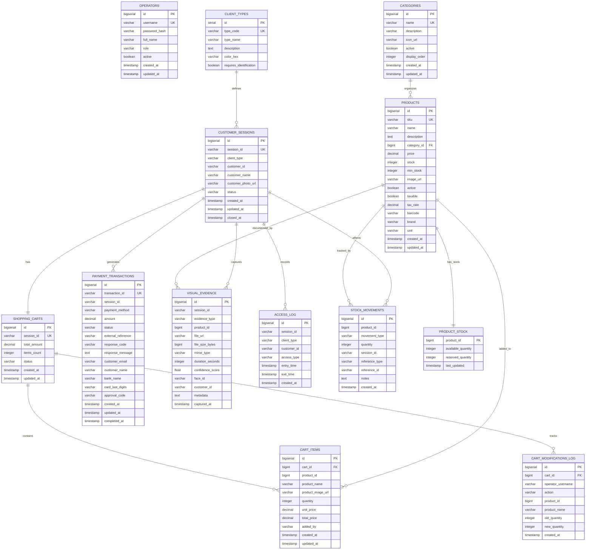

# Alwon POS - Diagrama del Modelo de Base de Datos

## Diagrama Entidad-Relación Completo

## Esquemas por Microservicio

### 1️⃣ Sessions Schema (Session Service - Port 8081)
- **OPERATORS**: Credenciales de operadores del sistema
- **CUSTOMER_SESSIONS**: Sesiones activas de clientes

**Relaciones:**
- Una sesión tiene un carrito
- Una sesión genera transacciones de pago
- Una sesión captura evidencia visual
- Una sesión registra accesos

---

### 2️⃣ Carts Schema (Cart Service - Port 8082)
- **SHOPPING_CARTS**: Carritos de compra por sesión
- **CART_ITEMS**: Ítems individuales en carritos
- **CART_MODIFICATIONS_LOG**: Auditoría de cambios por staff

**Relaciones:**
- Un carrito pertenece a una sesión (1:1)
- Un carrito tiene múltiples ítems (1:N)
- Un carrito registra múltiples modificaciones (1:N)
- Los ítems referencian productos

---

### 3️⃣ Products Schema (Product Service - Port 8083)
- **CATEGORIES**: Categorías de productos
- **PRODUCTS**: Catálogo completo de productos

**Relaciones:**
- Una categoría agrupa múltiples productos (1:N)
- Un producto puede estar en múltiples carritos
- Un producto tiene stock en inventario
- Un producto puede tener evidencia visual

---

### 4️⃣ Payments Schema (Payment Service - Port 8084)
- **PAYMENT_TRANSACTIONS**: Transacciones de pago

**Métodos Soportados:**
- PSE (Pagos Seguros en Línea)
- DEBIT (Tarjeta Débito)
- CREDIT (Tarjeta Crédito)

**Estados:**
- PENDING → PROCESSING → APPROVED/REJECTED/FAILED/CANCELLED

**Relaciones:**
- Una sesión puede tener múltiples transacciones (1:N)

---

### 5️⃣ Camera Schema (Camera Service - Port 8085)
- **VISUAL_EVIDENCE**: Evidencia visual capturada

**Tipos de Evidencia:**
- FACIAL_PHOTO: Reconocimiento facial
- PRODUCT_VIDEO: Videos de productos
- PRODUCT_GIF: GIFs de productos
- ENTRY_PHOTO: Foto al entrar
- EXIT_PHOTO: Foto al salir

**Relaciones:**
- Una sesión captura múltiples evidencias (1:N)
- Una evidencia puede estar asociada a un producto

---

### 6️⃣ Access Schema (Access Service - Port 8086)
- **CLIENT_TYPES**: Tipos de cliente configurados
- **ACCESS_LOG**: Registro de entradas/salidas

**Tipos de Cliente:**
- 🟢 **FACIAL**: Cliente con ID permanente (reconocimiento facial)
- 🟡 **PIN**: Cliente temporal (PIN eliminado tras pago)
- 🔴 **NO_ID**: Sin identificación (requiere evidencia visual)

**Relaciones:**
- Un tipo de cliente define múltiples sesiones (1:N)
- Una sesión registra múltiples accesos (1:N)

---

### 7️⃣ Inventory Schema (Inventory Service - Port 8087)
- **STOCK_MOVEMENTS**: Movimientos de inventario
- **PRODUCT_STOCK**: Stock actual por producto

**Tipos de Movimiento:**
- SALE: Venta
- RETURN: Devolución
- ADJUSTMENT: Ajuste manual
- RESTOCK: Reabastecimiento
- DAMAGE: Producto dañado

**Relaciones:**
- Un producto tiene un registro de stock (1:1)
- Un producto registra múltiples movimientos (1:N)
- Una sesión puede afectar múltiples movimientos (1:N)

---

## Estadísticas del Modelo

| Métrica | Valor |
|---------|-------|
| **Total Esquemas** | 7 |
| **Total Tablas** | 13 |
| **Total Índices** | 27 |
| **Relaciones 1:1** | 2 |
| **Relaciones 1:N** | 13 |
| **Foreign Keys** | 5 |

## Notas Técnicas

### Claves Primarias
- Todas usan `BIGSERIAL` (auto-increment) excepto `CLIENT_TYPES` (SERIAL)
- Identificadores de negocio (`session_id`, `transaction_id`, `sku`) tienen índices únicos

### Timestamps
- Todas las tablas incluyen `created_at`
- Tablas modificables incluyen `updated_at`
- Tablas con workflows incluyen timestamps de estado (`closed_at`, `completed_at`)

### Índices de Performance
- **27 índices** optimizan consultas frecuentes
- Foreign keys indexados
- Campos de búsqueda indexados (SKU, barcode, session_id, etc.)
- Campos de filtro indexados (status, active, client_type)

### Datos de Muestra
- ✅ 1 Operador admin (password: admin)
- ✅ 5 Categorías de productos
- ✅ 10 Productos de muestra
- ✅ 3 Tipos de cliente pre-configurados
- ✅ Stock inicial para productos (100 unidades c/u)
