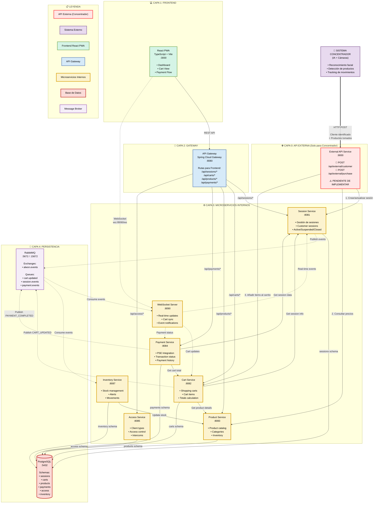

# Arquitectura de Microservicios - Alwon POS

## Versión Actual Implementada (Diciembre 2025)

Este diagrama muestra la arquitectura real del sistema Alwon POS tal como está implementada actualmente.



---

## Descripción de Capas

### 💻 Capa 1: Frontend

**React PWA** (Puerto 3000)
- **Framework:** React 18 + TypeScript + Vite
- **Estado:** Zustand
- **Routing:** React Router v6
- **API Client:** Axios con interceptores
- **PWA:** Service Workers para offline support

**Páginas Principales:**
1. **Dashboard** - Visualización de sesiones activas con carritos
2. **Cart View** - Detalle de carrito por sesión
3. **Payment Flow** - Proceso de pago con PSE

---

### 🚪 Capa 2: Gateway

**API Gateway** (Puerto 8080)
- **Tech Stack:** Spring Cloud Gateway
- **Funciones:**
  - Enrutamiento centralizado a microservicios
  - CORS configuration
  - Rate limiting (futuro)
  - Circuit breaker (futuro)

**Rutas Configuradas:**
```yaml
/api/sessions/** → session-service:8081
/api/carts/** → cart-service:8082
/api/products/** → product-service:8083
/api/payments/** → payment-service:8084
/api/access/** → access-service:8085
/api/camera/** → camera-service:8086
```

---

### ⚙️ Capa 3: Microservicios

#### 1. Session Service (Puerto 8081)
**Responsabilidades:**
- Gestión de sesiones de clientes (ACTIVE, SUSPENDED, AT_CHECKOUT, CLOSED)
- Tipos de cliente: FACIAL, PIN, NO_ID
- Información de cliente (nombre, foto, torre, apartamento)
- Timestamps de creación y actividad

**Schema BD:** `sessions.customer_sessions`

**Endpoints Principales:**
- `GET /sessions/active` - Sesiones activas
- `GET /sessions/{sessionId}` - Detalle de sesión
- `POST /sessions` - Crear sesión
- `POST /sessions/{sessionId}/close` - Cerrar sesión
- `PUT /sessions/{sessionId}/suspend` - Suspender sesión

---

#### 2. Cart Service (Puerto 8082) ✅ **RECIENTEMENTE CORREGIDO**
**Responsabilidades:**
- Gestión de carritos de compra
- Items del carrito (product_sku, quantity, unit_price, subtotal)
- Cálculo automático de totales
- Detección de productos por IA (detection_confidence, requires_review)

**Schema BD:** `carts.carts`, `carts.cart_items`

**Endpoints Principales:**
- `GET /carts/{sessionId}` - Obtener carrito por sesión
- `POST /carts/{sessionId}/items` - Añadir item
- `PATCH /carts/{sessionId}/items/{itemId}` - Actualizar cantidad
- `DELETE /carts/{sessionId}/items/{itemId}` - Eliminar item

**Correcciones Aplicadas (24 Dic 2025):**
- ✅ ShoppingCart entity sincronizada con tabla `carts`
- ✅ CartItem entity usando `product_sku` en lugar de `product_id`
- ✅ DTOs actualizados (CartResponse, AddItemRequest)
- ✅ Frontend Dashboard haciendo fetch de cart data

---

#### 3. Product Service (Puerto 8083)
**Responsabilidades:**
- Catálogo de productos
- Categorías de productos
- Precios y stock
- Información de impuestos

**Schema BD:** `products.products`, `products.categories`

**Endpoints Principales:**
- `GET /products` - Listar productos
- `GET /products/{id}` - Detalle de producto
- `GET /products/search?query=` - Buscar productos
- `GET /categories` - Listar categorías

---

#### 4. Payment Service (Puerto 8084)
**Responsabilidades:**
- Integración con PSE (Pagos Seguros en Línea)
- Gestión de transacciones
- Tracking de estados de pago
- Historial de pagos

**Schema BD:** `payments.transactions`

**Endpoints Principales:**
- `POST /payments/initiate` - Iniciar pago
- `GET /payments/{transactionId}` - Estado de pago
- `GET /payments/session/{sessionId}` - Pagos de sesión

---

#### 5. Access Service (Puerto 8085)
**Responsabilidades:**
- Tipos de cliente (FACIAL, PIN, NO_ID)
- Control de acceso
- Integración con intercoms
- Gestión de PINs temporales

**Schema BD:** `access.client_types`, `access.intercoms`

---

#### 6. Camera Service (Puerto 8086)
**Responsabilidades:**
- Reconocimiento facial
- Almacenamiento de evidencia visual (fotos/videos)
- Detección de productos por IA
- Confianza de detección y revisión manual

**Schema BD:** `camera.visual_evidence`, `camera.facial_recognition`

---

#### 7. Inventory Service (Puerto 8087)
**Responsabilidades:**
- Gestión de stock
- Alertas de stock bajo
- Movimientos de inventario
- Integración con Product Service

**Schema BD:** `inventory.stock_movements`, `inventory.alerts`

---

#### 8. WebSocket Server (Puerto 8090)
**Responsabilidades:**
- Comunicación en tiempo real con frontend
- Broadcasting de eventos (CART_UPDATED, SESSION_CREATED, PAYMENT_COMPLETED)
- Sincronización de múltiples clientes

**⚠️ ESTADO ACTUAL:** No disponible (conexión falla en frontend)
**TODO:** Implementar o configurar correctamente

---

### 💾 Capa 4: Persistencia

#### PostgreSQL (Puerto 5432)
**Arquitectura:** Multi-schema, un schema por dominio

**Schemas Implementados:**
1. **sessions** - Customer sessions
2. **carts** - Shopping carts y cart items
3. **products** - Products y categories
4. **payments** - Payment transactions
5. **access** - Client types y intercoms
6. **camera** - Visual evidence
7. **inventory** - Stock management

**Configuración:**
- Database: `alwon_pos`
- User: `alwon_user`
- Inicialización: `init-db.sql`

---

#### RabbitMQ (Puerto 5672 / UI: 15672)
**Propósito:** Message broker para eventos asíncronos

**Exchanges:**
- `alwon.events` (topic)

**Routing Keys:**
- `cart.updated`
- `session.created`
- `session.closed`
- `payment.completed`

**Consumidores:**
- WebSocket Server (para broadcast a clientes)
- Inventory Service (para actualizar stock)

---

## Características Clave

### 🔒 Seguridad
- ⚠️ **Autenticación de operadores:** Pendiente de implementar (Auth Service)
- API Gateway como punto único de entrada
- CORS configurado para frontend en localhost:3000
- Preparado para JWT tokens

### 🔄 Escalabilidad
- Microservicios independientes y escalables
- Base de datos compartida pero schemas separados
- Message broker para desacoplamiento

### 📱 Conectividad
- REST API para operaciones CRUD
- WebSocket para actualizaciones en tiempo real (pendiente configuración)
- Event-driven architecture con RabbitMQ

### 🎯 Flujo de Datos Principal

**Flujo de Compra:**
1. Cliente accede → Session Service crea sesión
2. Cliente toma productos → Cart Service registra items
3. Cliente va a pagar → Payment Service procesa PSE
4. Pago confirmado → Events notifican a todos los servicios

---

## Estado de Implementación (24 Diciembre 2025)

### ✅ Completamente Funcional
- Session Service
- Cart Service (corregido hoy)
- Product Service
- Frontend Dashboard
- Frontend Cart View
- API Gateway
- PostgreSQL con datos de prueba

### ⚠️ Implementado pero Requiere Configuración
- WebSocket Server (puerto 8090 no responde)
- RabbitMQ (contenedor corriendo pero eventos no configurados)

### 📋 Pendiente de Implementar
- **Auth Service** - Autenticación de operadores (User Stories creadas)
- Payment Service - Integración real con PSE
- Camera Service - Reconocimiento facial
- Access Service - Control de intercoms
- Inventory Service - Gestión de stock

---

## Puertos Asignados

| Servicio | Puerto | Estado |
|----------|--------|--------|
| Frontend PWA | 3000 | ✅ Running |
| API Gateway | 8080 | ✅ Running |
| Session Service | 8081 | ✅ Running |
| Cart Service | 8082 | ✅ Running |
| Product Service | 8083 | ✅ Running |
| Payment Service | 8084 | ⚠️ Parcial |
| Access Service | 8085 | ⚠️ Parcial |
| Camera Service | 8086 | ⚠️ Parcial |
| Inventory Service | 8087 | ⚠️ Parcial |
| WebSocket Server | 8090 | ❌ No funciona |
| PostgreSQL | 5432 | ✅ Running |
| RabbitMQ | 5672 | ✅ Running |
| RabbitMQ UI | 15672 | ✅ Running |

---

## Próximos Pasos

1. **Sprint 1:** Implementar Auth Service (User Stories US-BACKEND-001 a 006)
2. **Sprint 2:** Configurar WebSocket Server correctamente
3. **Sprint 3:** Implementar Payment Service con PSE real
4. **Sprint 4:** Camera Service con facial recognition

---

## Conectividad Tipos

```
→  REST API síncrono
-.-> WebSocket / Eventos asíncronos
```

---

**Última Actualización:** 24 Diciembre 2025  
**Versión del Diagrama:** 2.0 (Arquitectura Real Implementada)
