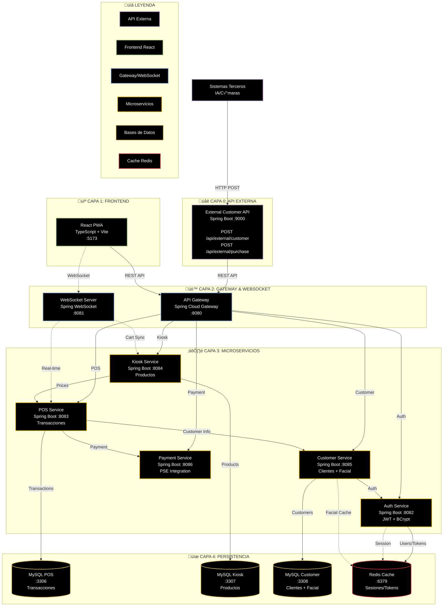

# Arquitectura de Microservicios - Alwon POS
## Versión con API Externa para Sistemas Terceros

Este diagrama muestra la arquitectura completa del sistema Alwon POS, incluyendo la nueva capa de API Externa que permite recibir información de clientes y compras desde sistemas de terceros (IA/Cámaras).

```mermaid
graph TB
    %% Estilos
    classDef external fill:#000,stroke:#9673a6,stroke-width:2px,color:#fff
    classDef frontend fill:#000,stroke:#82b366,stroke-width:2px,color:#fff
    classDef gateway fill:#000,stroke:#6c8ebf,stroke-width:2px,color:#fff
    classDef microservice fill:#000,stroke:#d79b00,stroke-width:2px,color:#fff
    classDef database fill:#000,stroke:#d6b656,stroke-width:2px,color:#fff
    classDef cache fill:#000,stroke:#c73232,stroke-width:2px,color:#fff
    
    %% Sistemas Externos (fuera de capas)
    THIRD["Sistemas Terceros#10;IA/C√°maras"]:::external
    
    %% CAPA 0: API EXTERNA
    subgraph CAPA0["üåê CAPA 0: API EXTERNA"]
        EXT["External Customer API#10;Spring Boot :9000#10;#10;POST /api/external/customer#10;POST /api/external/purchase"]:::external
    end
    
    %% CAPA 1: FRONTEND
    subgraph CAPA1["💻 CAPA 1: FRONTEND"]
        PWA["React PWA#10;TypeScript + Vite#10;:5173"]:::frontend
    end
    
    %% CAPA 2: GATEWAY & WEBSOCKET
    subgraph CAPA2["üö™ CAPA 2: GATEWAY & WEBSOCKET"]
        GW["API Gateway#10;Spring Cloud Gateway#10;:8080"]:::gateway
        WS["WebSocket Server#10;Spring WebSocket#10;:8081"]:::gateway
    end
    
    %% CAPA 3: MICROSERVICIOS
    subgraph CAPA3["⚙️ CAPA 3: MICROSERVICIOS"]
        AUTH["Auth Service#10;Spring Boot :8082#10;JWT + BCrypt"]:::microservice
        POS["POS Service#10;Spring Boot :8083#10;Transacciones"]:::microservice
        KIOSK["Kiosk Service#10;Spring Boot :8084#10;Productos"]:::microservice
        CUSTOMER["Customer Service#10;Spring Boot :8085#10;Clientes + Facial"]:::microservice
        PAYMENT["Payment Service#10;Spring Boot :8086#10;PSE Integration"]:::microservice
    end
    
    %% CAPA 4: PERSISTENCIA
    subgraph CAPA4["üíæ CAPA 4: PERSISTENCIA"]
        DB_POS[("MySQL POS#10;:3306#10;Transacciones")]:::database
        DB_KIOSK[("MySQL Kiosk#10;:3307#10;Productos")]:::database
        DB_CUSTOMER[("MySQL Customer#10;:3308#10;Clientes + Facial")]:::database
        REDIS[("Redis Cache#10;:6379#10;Sesiones/Tokens")]:::cache
    end
    
    %% CONEXIONES - Sistemas Externos
    THIRD -->|HTTP POST| EXT
    
    %% CONEXIONES - API Externa ‚Üí Gateway
    EXT -->|REST API| GW
    
    %% CONEXIONES - Frontend
    PWA -->|REST API| GW
    PWA -.->|WebSocket| WS
    
    %% CONEXIONES - Gateway ‚Üí Microservicios
    GW -->|Auth| AUTH
    GW -->|POS| POS
    GW -->|Kiosk| KIOSK
    GW -->|Customer| CUSTOMER
    GW -->|Payment| PAYMENT
    
    %% CONEXIONES - WebSocket
    WS -.->|Real-time| POS
    WS -.->|Cart Sync| KIOSK
    
    %% CONEXIONES - Microservicios entre sí
    POS -->|Customer Info| CUSTOMER
    POS -->|Payment| PAYMENT
    KIOSK -->|Prices| POS
    CUSTOMER -->|Auth| AUTH
    
    %% CONEXIONES - Microservicios ‚Üí Bases de Datos
    AUTH -->|Users/Tokens| REDIS
    POS -->|Transactions| DB_POS
    KIOSK -->|Products| DB_KIOSK
    CUSTOMER -->|Customers| DB_CUSTOMER
    
    %% CONEXIONES - Cache
    AUTH -.->|Session| REDIS
    CUSTOMER -.->|Facial Cache| REDIS
    
    %% LEYENDA VISUAL
    subgraph LEYENDA["üìã LEYENDA"]
        L1["API Externa"]:::external
        L2["Frontend React"]:::frontend
        L3["Gateway/WebSocket"]:::gateway
        L4["Microservicios"]:::microservice
        L5["Bases de Datos"]:::database
        L6["Cache Redis"]:::cache
    end
```

## Descripción de Capas

### üåê Capa 0: API Externa
**Propósito**: Recibir información de sistemas de terceros (IA, cámaras, otros sistemas) sobre clientes y compras.

- **External Customer API** (Puerto 9000)
  - `POST /api/external/customer` - Recibe información de clientes identificados
  - `POST /api/external/purchase` - Recibe información de compras detectadas
  - Manejo temporal de archivos multimedia
  - Integración con el API Gateway para enrutamiento interno

### 💻 Capa 1: Frontend
**Propósito**: Interfaz de usuario para operadores del POS.

- **React PWA** (Puerto 5173)
  - TypeScript + Vite
  - Zustand para estado global
  - Soporte offline (PWA)
  - Diseño responsivo para tablets Android

### üö™ Capa 2: Gateway & WebSocket
**Propósito**: Punto de entrada unificado y comunicación en tiempo real.

- **API Gateway** (Puerto 8080)
  - Enrutamiento centralizado
  - Balanceo de carga
  - Autenticación/Autorización
  
- **WebSocket Server** (Puerto 8081)
  - Actualizaciones en tiempo real
  - Sincronización de carritos
  - Notificaciones push

### ⚙️ Capa 3: Microservicios
**Propósito**: Lógica de negocio separada por dominio.

- **Auth Service** (Puerto 8082) - Autenticación JWT + BCrypt
- **POS Service** (Puerto 8083) - Gestión de transacciones
- **Kiosk Service** (Puerto 8084) - Cat√°logo de productos
- **Customer Service** (Puerto 8085) - Clientes + Reconocimiento facial
- **Payment Service** (Puerto 8086) - Integración con PSE

### üíæ Capa 4: Persistencia
**Propósito**: Almacenamiento de datos persistente y caché.

- **MySQL Databases** (Puertos 3306-3308) - Una base de datos por dominio
- **Redis Cache** (Puerto 6379) - Sesiones, tokens y caché de reconocimiento facial

## Características Clave

### üîí Seguridad
- JWT para autenticación
- BCrypt para passwords
- Tokens en Redis con TTL
- Validación en API Gateway

### 🔄 Escalabilidad
- Arquitectura de microservicios
- Base de datos por servicio
- Cache distribuido
- WebSocket para real-time

### üì± Conectividad
- **API Externa**: Sistemas terceros ‚Üí Alwon
- **REST API**: Frontend ‚Üí Backend
- **WebSocket**: Comunicación bidireccional en tiempo real
- **Inter-service**: Comunicación entre microservicios

### 🎯 Flujo de Datos Principal

1. **Sistema Externo** detecta cliente y productos
2. **External API** recibe datos vía POST
3. **API Gateway** enruta a servicios correspondientes
4. **Customer Service** procesa reconocimiento facial
5. **Kiosk Service** gestiona productos del carrito
6. **WebSocket** sincroniza con el frontend en tiempo real
7. **POS Service** procesa la transacción
8. **Payment Service** ejecuta el pago PSE

## Leyenda de Colores

- 🟣 **Violeta** - API Externa (Sistemas Terceros)
- 🟢 **Verde** - Frontend (React PWA)
- üîµ **Azul** - Gateway & WebSocket
- üü° **Amarillo** - Microservicios
- üü® **Amarillo Claro** - Bases de Datos
- 🔴 **Rojo** - Cache (Redis)

## Tipos de Conexiones

- **Línea Sólida** (→) - Comunicación REST/HTTP
- **Línea Punteada** (-..->) - Comunicación WebSocket o Cache

---

**Versión**: 2.0 - Con API Externa  
**Fecha**: Diciembre 2025  
**Proyecto**: Alwon POS
